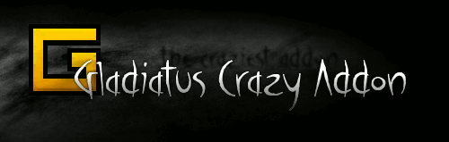

# Gladiatus Crazy Addon

> A browser extension for the "Gladiatus" browser game.

---

### Latest alpha builds v4.x.x
> 

> 

> [-lightgrey.svg?style=flat-square)](https://dinodevs.com) updated on 27-Jan-2017

### Latest stable releases v3.x.x
>  

>  

>  

>   ... we are working on it

---

