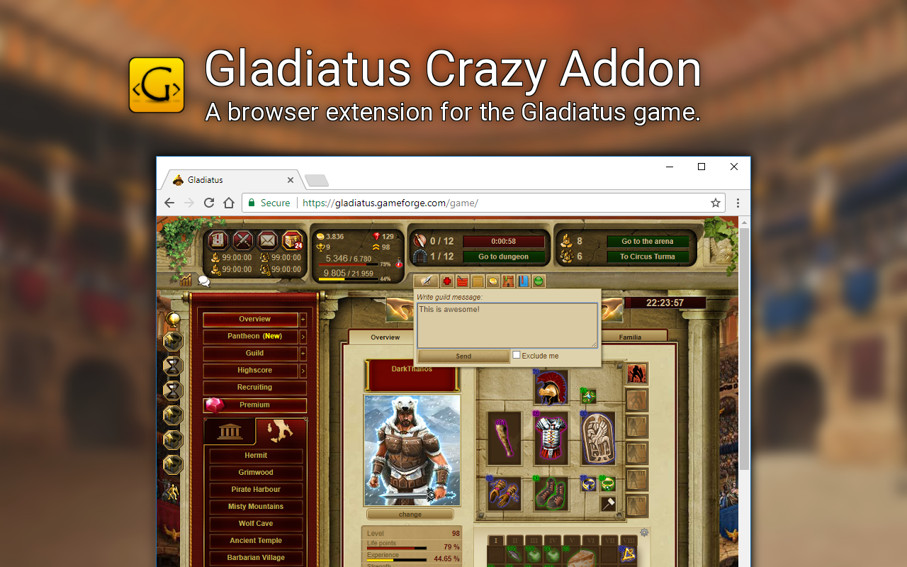

[![latest stable](https://img.shields.io/badge/latest%20stable-v4.3.1-green.svg?style=flat-square&logo=data%3Aimage%2Fpng%3Bbase64%2CiVBORw0KGgoAAAANSUhEUgAAABAAAAAQCAYAAAAf8%2F9hAAAABmJLR0QA%2FwD%2FAP%2BgvaeTAAAACXBIWXMAAAsTAAALEwEAmpwYAAAAB3RJTUUH3AkXFAgfNwj38gAAAjZJREFUOMuN00%2BIlVUYBvDf%2Bb6vMroYckstqmEaHWcMhUxXLaUgqKWraBEJQUobFdSBIBVXE4kbV7lTKNwKIgRBUYEltZlmZIKZyejPMCGjyXS%2FP6fF%2BW73jqsOnLM4532e932e9z0BO6Y%2FcGnnuK7o%2F63AzC0rR095M0xP%2Be7IIXtiKfTfY4pZvyIxpPuIrBA%2FuuBmMfG8bn1fGAbESMgIOXfvcmeVZ7aQFdQlIVCXwuSobhErYrk%2BSxY4Oc1PP%2FPow5QVM%2FPc%2FoOFL9jYSeFNRRFrYi8BITbsP8ipw5x9n7pJZWeBa1%2BxIRskjBWFoQryjANHOXeMF7ZRrg0MqbF%2FXwvsE9QMJATul8wvsWuUujfkZBy4P2yqaohg4TduzrF3IoFjsx4QWnNnF%2BlV7B5LEjI1i7f5cZZuhz%2F%2FQklTJuKmJFS8e5aDZxh5go8vMb%2BYJGR55MNP2D3K3jGufs3Sr4kkli1Zj50jTD7LIxnnD3P9G7KGrOxx8QjHL7C8wvlD7HqbL39ImftVVL2U8dYCn9%2FgvTeoytaD6h8%2BO0HV8M4rbH2c16eYfI5X9yQPrn%2FPS9uZeIrxLVRrfRNrVlf5e41NHYqcbZu5coKrN%2Fh2hiLjtRfZN55i79zjsQ2oxUJFp6DTabtVM%2FYkI11e3j7oYIY8TwO1dWM7tbWQzf5iJW%2FEppf09jVnNUXDQzHtvO1705qaN%2BLckuWA8dMHXJ54WjfGB%2F9fOwnpjP%2F9RMz9bnnqU2%2F9CwFg%2FBEGU%2FDFAAAAAElFTkSuQmCC)](https://github.com/DinoDevs/GladiatusCrazyAddon/releases/latest)
 [![latest alpha](https://img.shields.io/badge/latest%20dev-v4.3.2--beta-yellow.svg?style=flat-square&logo=data%3Aimage%2Fpng%3Bbase64%2CiVBORw0KGgoAAAANSUhEUgAAABAAAAAQCAYAAAAf8%2F9hAAAABmJLR0QA%2FwD%2FAP%2BgvaeTAAAACXBIWXMAAAsTAAALEwEAmpwYAAAAB3RJTUUH3AkXFAgfNwj38gAAAjZJREFUOMuN00%2BIlVUYBvDf%2Bb6vMroYckstqmEaHWcMhUxXLaUgqKWraBEJQUobFdSBIBVXE4kbV7lTKNwKIgRBUYEltZlmZIKZyejPMCGjyXS%2FP6fF%2BW73jqsOnLM4532e932e9z0BO6Y%2FcGnnuK7o%2F63AzC0rR095M0xP%2Be7IIXtiKfTfY4pZvyIxpPuIrBA%2FuuBmMfG8bn1fGAbESMgIOXfvcmeVZ7aQFdQlIVCXwuSobhErYrk%2BSxY4Oc1PP%2FPow5QVM%2FPc%2FoOFL9jYSeFNRRFrYi8BITbsP8ipw5x9n7pJZWeBa1%2BxIRskjBWFoQryjANHOXeMF7ZRrg0MqbF%2FXwvsE9QMJATul8wvsWuUujfkZBy4P2yqaohg4TduzrF3IoFjsx4QWnNnF%2BlV7B5LEjI1i7f5cZZuhz%2F%2FQklTJuKmJFS8e5aDZxh5go8vMb%2BYJGR55MNP2D3K3jGufs3Sr4kkli1Zj50jTD7LIxnnD3P9G7KGrOxx8QjHL7C8wvlD7HqbL39ImftVVL2U8dYCn9%2FgvTeoytaD6h8%2BO0HV8M4rbH2c16eYfI5X9yQPrn%2FPS9uZeIrxLVRrfRNrVlf5e41NHYqcbZu5coKrN%2Fh2hiLjtRfZN55i79zjsQ2oxUJFp6DTabtVM%2FYkI11e3j7oYIY8TwO1dWM7tbWQzf5iJW%2FEppf09jVnNUXDQzHtvO1705qaN%2BLckuWA8dMHXJ54WjfGB%2F9fOwnpjP%2F9RMz9bnnqU2%2F9CwFg%2FBEGU%2FDFAAAAAElFTkSuQmCC)](https://github.com/DinoDevs/GladiatusCrazyAddon/releases/latest)
[![Chrome Users](https://img.shields.io/chrome-web-store/users/dfbmiedjenagoegiiabjfjpkhfocifkp.svg?label=Chrome%20Users&style=flat-square&logo=data:image/png;base64,iVBORw0KGgoAAAANSUhEUgAAABAAAAAQCAYAAAAf8/9hAAADJElEQVR4AT1TQ4AuRxD+qnrm/2et5/VurGf73eJkr7Ft23ZyiXHKKafYtvNsrM351d1V2Z2gjfrKRe7ndZhq2x6NmJ3DIbc66XqloVLGx5arc62qCmLazSWl39de3DOy7y7PFIZovF0EABIGPz5XxkuvGJeeN5pL7dDgTWrtBRCZqSKAajIB9BKbl6i84pH6y/snDjyY4oZbC0K/nHkSz7tiTLY+XdEQWfuOUT0aIgkCOgVVQDxNTkCVwLzRlEcn1F2ZPdDxTMiJBjvuMiUukG8N89zIBJaZA58vkGSzQGJCCsyBqvdOVUIV+rMwWL3ysJeH4wAAzmlrvvmGj/fMPWqsYG2xCYM4RtHMGqSPXAkYRa7nN2THesmExSGztwaYW1E9eDPAd9Cpz55b9V1t+s/VWwbr7/iyQ5WFZqxYiY62G/Fp93RMtQ3NfThi5AFg5DtExSVqAiH11K6+ZK6xpy9eF1p/6b7pxVq/f5iOTJWg++IncO8X07B9d4zdnQV8tasSc49ehKbgC0ByRJRSCrmC0/IFO/UtogIxpG8eXQGeewy+7JmBzEiMijKDilKDXH4C722bBtTMBwUOlDJKhgDSliBxOAHpvMPG2SX4tKwaxXkPRwQkEVSIAkmjBJQc//0Eq8oeUYUXoSKTwgvcibktw6gpitA34TEwOcuiYhx/+CAwsRGgNAChKbAI9gRw8qMG3O5J69PMumN0iF7qeQVXH3ce/thVhYCB2jlDKMs+BUgvwEUKeFJFe8Hqj0ke1G9quE+ZbgdgGRSO2SxaK6qxbvahiHOCofbf8dph+1EepaAqdhIdetH7AdyRMGj8pbbERfwtiOYCapk4yDlLWckjN5jHW0dZtDV59XlxBhqK6J/jsV9ZWmJirvuzlvcv6ozZ+pNUZKNCQyceUWBUfSRtM0Jpq/eqeY9/wRtzeTlpCuydMnfM7ZTaSSbt87sOcMauUCf3Q7Uv5zxVuRzf3RozxJEX9Fmn94+OuxXpNB9wk2ATkPxfznV/1bEYQteR7XLEH7Mqd8Z++XEl2dZ35k8gzunuQkG/Ly/jETCxOAUzBAD+BhTZxancWpFRAAAAAElFTkSuQmCC)](https://chrome.google.com/webstore/detail/gladiatus-crazy-add-on/dfbmiedjenagoegiiabjfjpkhfocifkp)
[![Firefox Users](https://img.shields.io/amo/users/gladiatus-crazy-add-on.svg?label=Firefox%20Users&style=flat-square&logo=data:image/png;base64,iVBORw0KGgoAAAANSUhEUgAAABAAAAAQCAYAAAAf8/9hAAADeUlEQVR4AU1TU2DEaBicP8m6tm3zbNu2ns62bdu27att2263q2yTTbL5rtvjw3yambdvQG+dDPlCsNeuu4w/9skuLrB/PrIWd1eD/fTra5y3XV/juO2WetcpLw/I0QHura5ZVvP81XxgDmCn/P7hLdwOOaWHXPHlzGPHfbzuPOmLDbrou1X9ou/X9LO+XKYLPp/bfL1z4/5vRbIFtD19d+14WKBsDNdV9hv33P+eyEdO9Lhcu+XEj1BUhImmsTcZORV2n8ppdhG7hijshFxxRf359Sv3TfZ+9Pt+93ECAIwP2w7SrYsPni/eogVHi/70sHXuQufTnF0ghJIXXlmFZd1JQ8ua/+xqW2zkQZUf9vR9IB1Qc8vXHACYrMaUlKBNHIAW2sfSzytTGtt/8BvssfAZ3GsizHY3jKrG5hadfO848ydVhCHj0NArAYDN3ZoX71ujbo1YLFl5MsQxpqk+WMR0vGM6GB95q2DeckL3erElA6nBa/TdoxpjqFmTl78vFnwO7KWIiIWRSND9jNwcIhM13O3aCz/OFSGSLUIWJSieze2+hbLDspjPN0zwFcV0vdZyIud1Ilz1AdBAqsxgH1Bx07d74rt+K9TFCcxMOeFcnAe5V+BZmEduUjesMTP6zKKIXk9ymiBL0JiPQeAJikqwmYDdw1fQOzuP+HAfqjMcqBkKx+SUB0ZNRpBzDHA4WLCqYI982xirOzIvyy+jK9hCwWYbiBkZM1s0+HgBAvkxLgt4eyUbP3XZUJG9hM/uXiGESUwbFDapy1LB7X1K8YS8Re0ekUGVoZNKEEUB33ZbcdHnCTjx42x82wrYNDtOrXKCc2u0XmNDz4/WuejyglkOADQFj4segltk8G2BDDrhoGwJJ1Z6cXbRKq4oWcKHpyzh6HgFG41GfapVwOA41wwAwvePDHBHXVfy3fsP9DwHnb+E/EzTNHBWs86OiXSx4+MBZmDk34Z3CrrsZoLZrdTtEaPcCOCvLPQdVsQARN6VlPzFx4U59MtueXr9AfnUcngedRyVR93HBpDv/2r/AnqqOP1XAFEB3/mp0QyBYb+wEFZos1qB7QcLDrvlwZSUntdyM10flWZrn1RmKx9VZTleL88cPTsp5VkBXF5GhNF8a2ES908a/8XPZUUcz8ADiAsDv+v+1pCjq0xBh1vAVwOIB3bCx/7v+RODWtK1Q31ZvwAAAABJRU5ErkJggg==)](https://addons.mozilla.org/firefox/addon/gladiatus-crazy-add-on/)

<h1 align="center">Gladiatus Crazy Addon</h1>
<h4 align="center"> A browser extension for the "Gladiatus" browser game.</h4>

 • <a href="README.md#paperclip-downloads">Downloads</a> • <a href="README.md#page_with_curl-installation">Installation</a> • <a href="README.md#computer-developers-docs">Developers Docs</a> • <a href="README.md#speech_balloon-contact-us">Contact Us</a> • 

## :paperclip: Downloads

We suggest you to download a *stable release*. Alpha and Beta releases are for developers (unless you want to check out the latest features and give us some feedback).

### Latest public release v4.3.1 (recommended)

Fast install from Google web store & Firefox addons' page :

[![version](https://img.shields.io/badge/store-v4.3.1-green.svg?style=flat-square&logo=data%3Aimage%2Fpng%3Bbase64%2CiVBORw0KGgoAAAANSUhEUgAAABAAAAAQCAYAAAAf8%2F9hAAADJElEQVR4AT1TQ4AuRxD%2Bqnrm%2F2et5%2FVurGf73eJkr7Ft23ZyiXHKKafYtvNsrM351d1V2Z2gjfrKRe7ndZhq2x6NmJ3DIbc66XqloVLGx5arc62qCmLazSWl39de3DOy7y7PFIZovF0EABIGPz5XxkuvGJeeN5pL7dDgTWrtBRCZqSKAajIB9BKbl6i84pH6y%2FsnDjyY4oZbC0K%2FnHkSz7tiTLY%2BXdEQWfuOUT0aIgkCOgVVQDxNTkCVwLzRlEcn1F2ZPdDxTMiJBjvuMiUukG8N89zIBJaZA58vkGSzQGJCCsyBqvdOVUIV%2BrMwWL3ysJeH4wAAzmlrvvmGj%2FfMPWqsYG2xCYM4RtHMGqSPXAkYRa7nN2THesmExSGztwaYW1E9eDPAd9Cpz55b9V1t%2Bs%2FVWwbr7%2FiyQ5WFZqxYiY62G%2FFp93RMtQ3NfThi5AFg5DtExSVqAiH11K6%2BZK6xpy9eF1p%2F6b7pxVq%2Ff5iOTJWg%2B%2BIncO8X07B9d4zdnQV8tasSc49ehKbgC0ByRJRSCrmC0%2FIFO%2FUtogIxpG8eXQGeewy%2B7JmBzEiMijKDilKDXH4C722bBtTMBwUOlDJKhgDSliBxOAHpvMPG2SX4tKwaxXkPRwQkEVSIAkmjBJQc%2F%2F0Eq8oeUYUXoSKTwgvcibktw6gpitA34TEwOcuiYhx%2F%2BCAwsRGgNAChKbAI9gRw8qMG3O5J69PMumN0iF7qeQVXH3ce%2FthVhYCB2jlDKMs%2BBUgvwEUKeFJFe8Hqj0ke1G9quE%2BZbgdgGRSO2SxaK6qxbvahiHOCofbf8dph%2B1EepaAqdhIdetH7AdyRMGj8pbbERfwtiOYCapk4yDlLWckjN5jHW0dZtDV59XlxBhqK6J%2FjsV9ZWmJirvuzlvcv6ozZ%2BpNUZKNCQyceUWBUfSRtM0Jpq%2FeqeY9%2FwRtzeTlpCuydMnfM7ZTaSSbt87sOcMauUCf3Q7Uv5zxVuRzf3RozxJEX9Fmn94%2BOuxXpNB9wk2ATkPxfznV%2F1bEYQteR7XLEH7Mqd8Z%2B%2BXEl2dZ35k8gzunuQkG%2FLy%2FjETCxOAUzBAD%2BBhTZxancWpFRAAAAAElFTkSuQmCC)](https://chrome.google.com/webstore/detail/dfbmiedjenagoegiiabjfjpkhfocifkp)
[![version](https://img.shields.io/badge/store-v4.3.1-green.svg?style=flat-square&logo=data%3Aimage%2Fpng%3Bbase64%2CiVBORw0KGgoAAAANSUhEUgAAABAAAAAQCAYAAAAf8%2F9hAAADFElEQVR4AUVSY7hrSRCsnqMkF8HlyUmebdu28Xtt27Zt2%2Fbus23btk9metOP%2FX01Va0xePhwCI6nG1Eu00SJ3u038I6mG7YOg8ajuUrL0VyrU2vT6WJPcj8Xl6hPYzE61wcZDvoNSXhlRR3nVLrRdTpovIKDJloHjXhPeS1em8rq5YlgxYpk9rpT2daO1E4pC0iYDvkNqKhdXd4zY0UqqazvLVBXgHDIhMdmHNk9bsWxfSciRD1ipFKesqEUTdxmwhHXDRi074M%2F%2FiDILG%2FEAytMNxrHQWMWHEk3XPtOvLyp5ATXRAuCL%2BPxaT8lEvxDPM4%2FJBLjnqxa1Tp%2FhMN%2BgxvzW%2Bf8JOFxv6FeWFa7o8T3B43tJcVJKcQzqVTV%2FzKZ3ZOzWTMxk%2BG8vlHi%2BCZRxTtU2WDp0coGLNhVUe97SRi%2FoS0smFK1qsPCtWs%2FtbBePRbMq1t36dvVq3t2SzvSPDSmXg7QDFjH2PwJADtzOa7EGYvF41rY8bw%2FY7Z9uyJiw1yvpes2t08ZU%2FMkQxGgDYATbNZK8TGjcc4irisEx3U3xVw3VEQOA6RzuZp2vpBcAgiATHCKDUNYM85ZYSQihHg0yjHHgQIg2ZPKIvuA1us9AssEYiG4BoBxOTYXJvA8IRRHItmoZTkESBbGmPXqh1OH5x3UuVXHtLaOao2TWveBmFLn5kQyErEgEzlOb9e24ToOkWWt%2BnzHjnlyy%2FjR828f5wU83gvCcXn84vqtJP5XsqpzrGcfW%2FSOXr383IAB23ngQDZ57Ord%2B3aJ2zLzE%2FrAS7eieGgM1IElQPhkxqI1g%2Ft0a7FG3PW796ayRYWfWUpVin8kDKeNXbDgpXGdOgFPUZJkpltV3P%2BYSmd%2BQ2X8bR6%2FRIODqxu3%2FoKHDH6fhw3dzoMH88k%2BfXlHtx4zf2zbplJ6ZnXoQBDxglVCwj3hRV9G8p4PUbLhE5SYr1QZ%2F52oxlPSdfO%2Fr9767ypq3N0KiErttw2a0vmvLPhQldHvyleiByNa%2FDAlej6NxCUPInrJ5aCeWaCYZdX%2B%2FdWqPn3oXN%2F%2Fu2tsDHVsOH4AAAAASUVORK5CYII%3D)](https://chrome.google.com/webstore/detail/dfbmiedjenagoegiiabjfjpkhfocifkp)
[![version](https://img.shields.io/badge/addon_page-v4.3.1-green.svg?style=flat-square&logo=data%3Aimage%2Fpng%3Bbase64%2CiVBORw0KGgoAAAANSUhEUgAAABAAAAAQCAYAAAAf8%2F9hAAADeUlEQVR4AU1TU2DEaBicP8m6tm3zbNu2ns62bdu27att2263q2yTTbL5rtvjw3yambdvQG%2BdDPlCsNeuu4w%2F9skuLrB%2FPrIWd1eD%2FfTra5y3XV%2FjuO2WetcpLw%2FI0QHura5ZVvP81XxgDmCn%2FP7hLdwOOaWHXPHlzGPHfbzuPOmLDbrou1X9ou%2FX9LO%2BXKYLPp%2FbfL1z4%2F5vRbIFtD19d%2B14WKBsDNdV9hv33P%2BeyEdO9Lhcu%2BXEj1BUhImmsTcZORV2n8ppdhG7hijshFxxRf359Sv3TfZ%2B9Pt%2B93ECAIwP2w7SrYsPni%2FeogVHi%2F70sHXuQufTnF0ghJIXXlmFZd1JQ8ua%2F%2BxqW2zkQZUf9vR9IB1Qc8vXHACYrMaUlKBNHIAW2sfSzytTGtt%2F8BvssfAZ3GsizHY3jKrG5hadfO848ydVhCHj0NArAYDN3ZoX71ujbo1YLFl5MsQxpqk%2BWMR0vGM6GB95q2DeckL3erElA6nBa%2FTdoxpjqFmTl78vFnwO7KWIiIWRSND9jNwcIhM13O3aCz%2FOFSGSLUIWJSieze2%2BhbLDspjPN0zwFcV0vdZyIud1Ilz1AdBAqsxgH1Bx07d74rt%2BK9TFCcxMOeFcnAe5V%2BBZmEduUjesMTP6zKKIXk9ymiBL0JiPQeAJikqwmYDdw1fQOzuP%2BHAfqjMcqBkKx%2BSUB0ZNRpBzDHA4WLCqYI982xirOzIvyy%2BjK9hCwWYbiBkZM1s0%2BHgBAvkxLgt4eyUbP3XZUJG9hM%2FuXiGESUwbFDapy1LB7X1K8YS8Re0ekUGVoZNKEEUB33ZbcdHnCTjx42x82wrYNDtOrXKCc2u0XmNDz4%2FWuejyglkOADQFj4segltk8G2BDDrhoGwJJ1Z6cXbRKq4oWcKHpyzh6HgFG41GfapVwOA41wwAwvePDHBHXVfy3fsP9DwHnb%2BE%2FEzTNHBWs86OiXSx4%2BMBZmDk34Z3CrrsZoLZrdTtEaPcCOCvLPQdVsQARN6VlPzFx4U59MtueXr9AfnUcngedRyVR93HBpDv%2F2r%2FAnqqOP1XAFEB3%2Fmp0QyBYb%2BwEFZos1qB7QcLDrvlwZSUntdyM10flWZrn1RmKx9VZTleL88cPTsp5VkBXF5GhNF8a2ES908a%2F8XPZUUcz8ADiAsDv%2Bv%2B1pCjq0xBh1vAVwOIB3bCx%2F7v%2BRODWtK1Q31ZvwAAAABJRU5ErkJggg%3D%3D)](https://addons.mozilla.org/el/firefox/addon/gladiatus-crazy-add-on/)

Custom install using the addon file:

[![version](https://img.shields.io/badge/version-v4.3.1-green.svg?style=flat-square&logo=data%3Aimage%2Fpng%3Bbase64%2CiVBORw0KGgoAAAANSUhEUgAAABAAAAAQCAYAAAAf8%2F9hAAADJElEQVR4AT1TQ4AuRxD%2Bqnrm%2F2et5%2FVurGf73eJkr7Ft23ZyiXHKKafYtvNsrM351d1V2Z2gjfrKRe7ndZhq2x6NmJ3DIbc66XqloVLGx5arc62qCmLazSWl39de3DOy7y7PFIZovF0EABIGPz5XxkuvGJeeN5pL7dDgTWrtBRCZqSKAajIB9BKbl6i84pH6y%2FsnDjyY4oZbC0K%2FnHkSz7tiTLY%2BXdEQWfuOUT0aIgkCOgVVQDxNTkCVwLzRlEcn1F2ZPdDxTMiJBjvuMiUukG8N89zIBJaZA58vkGSzQGJCCsyBqvdOVUIV%2BrMwWL3ysJeH4wAAzmlrvvmGj%2FfMPWqsYG2xCYM4RtHMGqSPXAkYRa7nN2THesmExSGztwaYW1E9eDPAd9Cpz55b9V1t%2Bs%2FVWwbr7%2FiyQ5WFZqxYiY62G%2FFp93RMtQ3NfThi5AFg5DtExSVqAiH11K6%2BZK6xpy9eF1p%2F6b7pxVq%2Ff5iOTJWg%2B%2BIncO8X07B9d4zdnQV8tasSc49ehKbgC0ByRJRSCrmC0%2FIFO%2FUtogIxpG8eXQGeewy%2B7JmBzEiMijKDilKDXH4C722bBtTMBwUOlDJKhgDSliBxOAHpvMPG2SX4tKwaxXkPRwQkEVSIAkmjBJQc%2F%2F0Eq8oeUYUXoSKTwgvcibktw6gpitA34TEwOcuiYhx%2F%2BCAwsRGgNAChKbAI9gRw8qMG3O5J69PMumN0iF7qeQVXH3ce%2FthVhYCB2jlDKMs%2BBUgvwEUKeFJFe8Hqj0ke1G9quE%2BZbgdgGRSO2SxaK6qxbvahiHOCofbf8dph%2B1EepaAqdhIdetH7AdyRMGj8pbbERfwtiOYCapk4yDlLWckjN5jHW0dZtDV59XlxBhqK6J%2FjsV9ZWmJirvuzlvcv6ozZ%2BpNUZKNCQyceUWBUfSRtM0Jpq%2FeqeY9%2FwRtzeTlpCuydMnfM7ZTaSSbt87sOcMauUCf3Q7Uv5zxVuRzf3RozxJEX9Fmn94%2BOuxXpNB9wk2ATkPxfznV%2F1bEYQteR7XLEH7Mqd8Z%2B%2BXEl2dZ35k8gzunuQkG%2FLy%2FjETCxOAUzBAD%2BBhTZxancWpFRAAAAAElFTkSuQmCC)](https://github.com/DinoDevs/GladiatusCrazyAddon/releases/latest)
[![version](https://img.shields.io/badge/version-v4.3.1-green.svg?style=flat-square&logo=data%3Aimage%2Fpng%3Bbase64%2CiVBORw0KGgoAAAANSUhEUgAAABAAAAAQCAYAAAAf8%2F9hAAADeUlEQVR4AU1TU2DEaBicP8m6tm3zbNu2ns62bdu27att2263q2yTTbL5rtvjw3yambdvQG%2BdDPlCsNeuu4w%2F9skuLrB%2FPrIWd1eD%2FfTra5y3XV%2FjuO2WetcpLw%2FI0QHura5ZVvP81XxgDmCn%2FP7hLdwOOaWHXPHlzGPHfbzuPOmLDbrou1X9ou%2FX9LO%2BXKYLPp%2FbfL1z4%2F5vRbIFtD19d%2B14WKBsDNdV9hv33P%2BeyEdO9Lhcu%2BXEj1BUhImmsTcZORV2n8ppdhG7hijshFxxRf359Sv3TfZ%2B9Pt%2B93ECAIwP2w7SrYsPni%2FeogVHi%2F70sHXuQufTnF0ghJIXXlmFZd1JQ8ua%2F%2BxqW2zkQZUf9vR9IB1Qc8vXHACYrMaUlKBNHIAW2sfSzytTGtt%2F8BvssfAZ3GsizHY3jKrG5hadfO848ydVhCHj0NArAYDN3ZoX71ujbo1YLFl5MsQxpqk%2BWMR0vGM6GB95q2DeckL3erElA6nBa%2FTdoxpjqFmTl78vFnwO7KWIiIWRSND9jNwcIhM13O3aCz%2FOFSGSLUIWJSieze2%2BhbLDspjPN0zwFcV0vdZyIud1Ilz1AdBAqsxgH1Bx07d74rt%2BK9TFCcxMOeFcnAe5V%2BBZmEduUjesMTP6zKKIXk9ymiBL0JiPQeAJikqwmYDdw1fQOzuP%2BHAfqjMcqBkKx%2BSUB0ZNRpBzDHA4WLCqYI982xirOzIvyy%2BjK9hCwWYbiBkZM1s0%2BHgBAvkxLgt4eyUbP3XZUJG9hM%2FuXiGESUwbFDapy1LB7X1K8YS8Re0ekUGVoZNKEEUB33ZbcdHnCTjx42x82wrYNDtOrXKCc2u0XmNDz4%2FWuejyglkOADQFj4segltk8G2BDDrhoGwJJ1Z6cXbRKq4oWcKHpyzh6HgFG41GfapVwOA41wwAwvePDHBHXVfy3fsP9DwHnb%2BE%2FEzTNHBWs86OiXSx4%2BMBZmDk34Z3CrrsZoLZrdTtEaPcCOCvLPQdVsQARN6VlPzFx4U59MtueXr9AfnUcngedRyVR93HBpDv%2F2r%2FAnqqOP1XAFEB3%2Fmp0QyBYb%2BwEFZos1qB7QcLDrvlwZSUntdyM10flWZrn1RmKx9VZTleL88cPTsp5VkBXF5GhNF8a2ES908a%2F8XPZUUcz8ADiAsDv%2Bv%2B1pCjq0xBh1vAVwOIB3bCx%2F7v%2BRODWtK1Q31ZvwAAAABJRU5ErkJggg%3D%3D)](https://github.com/DinoDevs/GladiatusCrazyAddon/releases/latest)
[![version](https://img.shields.io/badge/version-v4.3.1-green.svg?style=flat-square&logo=data%3Aimage%2Fpng%3Bbase64%2CiVBORw0KGgoAAAANSUhEUgAAABAAAAAQCAYAAAAf8%2F9hAAADFElEQVR4AUVSY7hrSRCsnqMkF8HlyUmebdu28Xtt27Zt2%2Fbus23btk9metOP%2FX01Va0xePhwCI6nG1Eu00SJ3u038I6mG7YOg8ajuUrL0VyrU2vT6WJPcj8Xl6hPYzE61wcZDvoNSXhlRR3nVLrRdTpovIKDJloHjXhPeS1em8rq5YlgxYpk9rpT2daO1E4pC0iYDvkNqKhdXd4zY0UqqazvLVBXgHDIhMdmHNk9bsWxfSciRD1ipFKesqEUTdxmwhHXDRi074M%2F%2FiDILG%2FEAytMNxrHQWMWHEk3XPtOvLyp5ATXRAuCL%2BPxaT8lEvxDPM4%2FJBLjnqxa1Tp%2FhMN%2BgxvzW%2Bf8JOFxv6FeWFa7o8T3B43tJcVJKcQzqVTV%2FzKZ3ZOzWTMxk%2BG8vlHi%2BCZRxTtU2WDp0coGLNhVUe97SRi%2FoS0smFK1qsPCtWs%2FtbBePRbMq1t36dvVq3t2SzvSPDSmXg7QDFjH2PwJADtzOa7EGYvF41rY8bw%2FY7Z9uyJiw1yvpes2t08ZU%2FMkQxGgDYATbNZK8TGjcc4irisEx3U3xVw3VEQOA6RzuZp2vpBcAgiATHCKDUNYM85ZYSQihHg0yjHHgQIg2ZPKIvuA1us9AssEYiG4BoBxOTYXJvA8IRRHItmoZTkESBbGmPXqh1OH5x3UuVXHtLaOao2TWveBmFLn5kQyErEgEzlOb9e24ToOkWWt%2BnzHjnlyy%2FjR828f5wU83gvCcXn84vqtJP5XsqpzrGcfW%2FSOXr383IAB23ngQDZ57Ord%2B3aJ2zLzE%2FrAS7eieGgM1IElQPhkxqI1g%2Ft0a7FG3PW796ayRYWfWUpVin8kDKeNXbDgpXGdOgFPUZJkpltV3P%2BYSmd%2BQ2X8bR6%2FRIODqxu3%2FoKHDH6fhw3dzoMH88k%2BfXlHtx4zf2zbplJ6ZnXoQBDxglVCwj3hRV9G8p4PUbLhE5SYr1QZ%2F52oxlPSdfO%2Fr9767ypq3N0KiErttw2a0vmvLPhQldHvyleiByNa%2FDAlej6NxCUPInrJ5aCeWaCYZdX%2B%2FdWqPn3oXN%2F%2Fu2tsDHVsOH4AAAAASUVORK5CYII%3D)](https://github.com/DinoDevs/GladiatusCrazyAddon/releases/latest)

### Latest dev build v4.3.2-beta (for developers) [[Latest Progress Here]](PROGRESS.md)

All releases: [stable-releases](https://github.com/DinoDevs/GladiatusCrazyAddon/releases)

## :page_with_curl: Installation

If you are new to installing browsers addons/extensions or you just want to jump on a new browser, follow our steps for installing our addon.

Find set-by-step guides for all major browsers on our [installation docs](documentation/installation.md).

## :books: Translation

Use our [guide](documentation/translators/README.md) to translate the addon in your language!

## :link: Gladiatus related links

### Our links

Gladiatus Crazy Addon : [https://gladiatus.dinodevs.com](https://gladiatus.dinodevs.com)

Gladiatus Simulator : [https://simulator.dinodevs.com](https://simulator.dinodevs.com)

Gladiatus Forum GCA thread : [https://forum.gladiatus.gameforge.com/forum/thread/263-gladiatus-crazy-add-on/](https://forum.gladiatus.gameforge.com/forum/thread/263-gladiatus-crazy-add-on/)

### Other links/pages

[Skarsburning](https://forum.gladiatus.gameforge.com/user/369-skarsburning/)'s Gladiatus Fansite : [https://gladiatus.gamerz-bg.com](https://gladiatus.gamerz-bg.com) *(we love your site)*

[Michalus](https://forum.gladiatus.gameforge.com/user/69-michalus/)' Gladiatus Tools : [https://en.gladiatus-tools.com](https://en.gladiatus-tools.com)

Unofficial Gladiatus Reddit : [https://www.reddit.com/r/Gladiatus/](https://www.reddit.com/r/Gladiatus/) (by [Williaf](https://www.reddit.com/user/Williaf))

Official Gladiatus Discord Server : [https://discord.gg/uacMu7](https://discord.gg/uacMu7)

*(We would be happy to add your Gladiatus related page here too)*

## :computer: Developers Docs

We will try to provide some more info for anyone that wants to jump into the action.

[Dev docs under construction](documentation/)

## :speech_balloon: Contact us

Contact us to leave us your feedback or to express your thoughts.

## :video_game: Our team

 We are [DinoDevs](https://github.com/DinoDevs), a group of people coding for fun!

DinoDevs members working on this project:
<dl>
  <dt>GreatApo ~ https://github.com/GreatApo</dt>
  <dd>Description not found!</dd>

  <dt>GramThanos ~ https://github.com/GramThanos</dt>
  <dd>I like to code!</dd>
</dl>

## :thumbsup: Special Thanks

We need to give some attribute on all the people of the community that help us maintain the code by reporting bugs, translating the addon, contributing to our code and donating to the project. Thank YOU!

## :scroll: License

This project is under [The MIT license](https://opensource.org/licenses/MIT).
We do although appreciate attribute.
