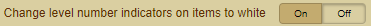
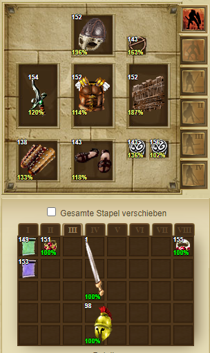
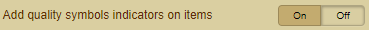
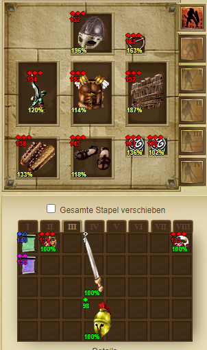
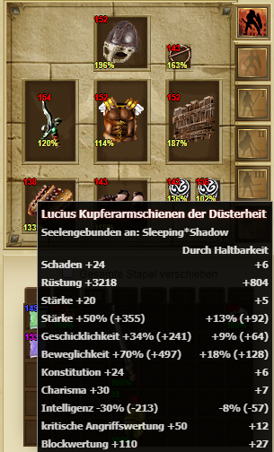
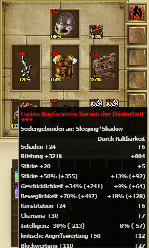

## Index
- [Change level number indicators on items to white](Documentation%20Accessibility.md#change-level-number-indicators-on-items-to-white)
- [Add quality symbols indicators on items](Documentation%20Accessibility.md#add-quality-symbols-indicators-on-items)
- [Change item title in tooltips to white](Documentation%20Accessibility.md#change-item-title-in-tooltips-to-white)
- [Add quality symbols on tooltips](Documentation%20Accessibility.md#add-quality-symbols-on-tooltips)

## Accessibility
### Change level number indicators on items to white
- Change the level display of the items to the color white

### Add quality symbols indicators on items
- Adds a symbol as a quality indicator on the item

### Change item title in tooltips to white
- Change the title of the item in the tooltip to the color white

### Add quality symbols on tooltips
- Add a symbol as a quality indicator in the tooltip

