## Index

- [Ignore attack confirmations](Documentation%20Arena.md#ignore-attack-confirmations)
- [Show an image-link to the simulator](Documentation%20Arena.md#show-an-image-link-to-the-simulator)
- [Sort players in arena by level](Documentation%20Arena.md#sort-players-in-arena-by-level)
- [Highlight players on other servers that may be guild members](Documentation%20Arena.md#highlight-players-on-other-servers-that-may-be-guild-members)
- [Players target list](Documentation%20Arena.md#players-target-list)

## Arena
### Ignore attack confirmations
- Ignore the message that the enemy was attacked already 5x per Arena from you

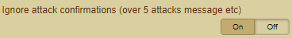

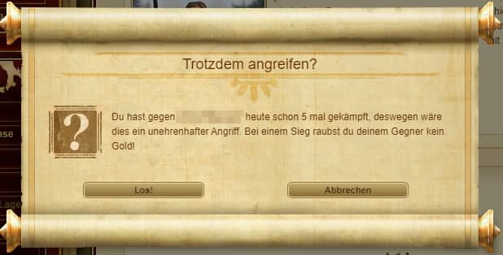

### Show an image-link to the simulator
- Shows in the arenas a link to the attack simulator from GCA Team (simulator.dinodevs.com)

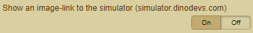

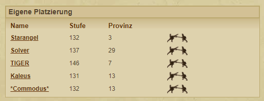
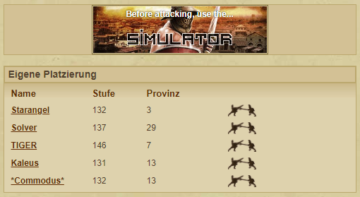

### Sort players in arena by level
- Sorts the opponents in the arena after the player Level

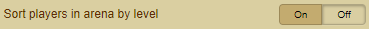

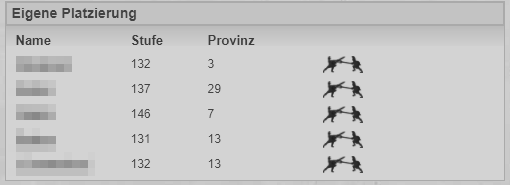
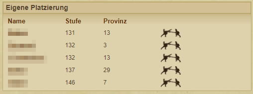

### Highlight players on other servers that may be guild members
- Mark guild members on other servers (same name)

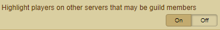

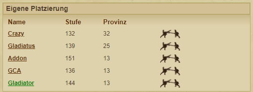

### Players target list
- Activates a target list under the heading "Familia".
- Add different opponents to the list and color them as you like.

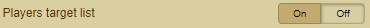

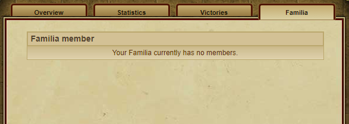
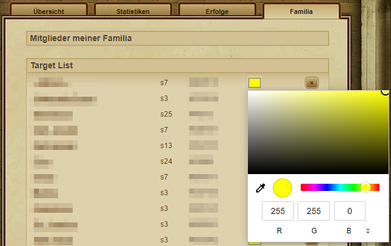

