## Index
- [Count items and bidden items](Documentation%20Auction.md#count-items-and-bidden-items)
- [Show more levels in search options](Documentation%20Auction.md#show-more-levels-in-search-options)
- [Analyze items' prices](Documentation%20Auction.md#analyze-items-prices)
- [Show items' level](Documentation%20Auction.md#show-items-level)
- [Show items' name](Documentation%20Auction.md#show-items-name)
- [Change layout to 3 items per line](Documentation%20Auction.md#change-layout-to-3-items-per-line)
- [Bid many items without page refresh](Documentation%20Auction.md#bid-many-items-without-page-refresh)
- [Show extra stats on item images](Documentation%20Auction.md#show-extra-stats-on-item-images)
- [Implemented auction save search and load it by default](Documentation%20Auction.md#implemented-auction-save-search-and-load-it-by-default)

## Auction
### Count items and bidden items
- Shows the total of the items to be auctioned per category
- Shows the number of items already auctioned per category

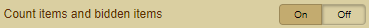

### Show more levels in search options
- Shows multiple levels in the Search Options

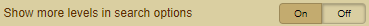

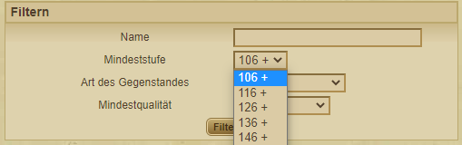
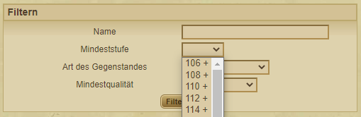

### Analyze items' prices
- Analyzes the price per item and shows whether the item is overpriced or sold as an item value (hide your gold here).
- Click on the coin () to display all "hide your gold here" items

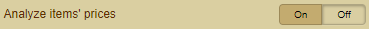

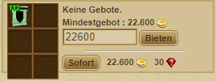
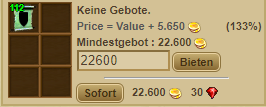
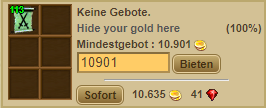

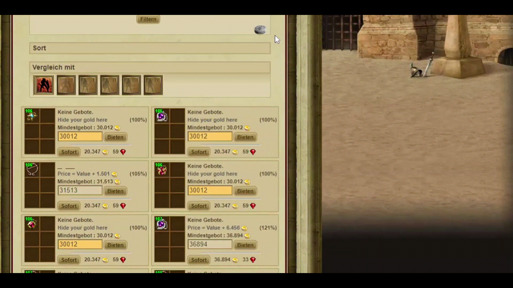

### Show items' level
- Show the level of the item again

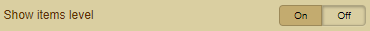

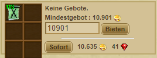
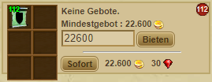

### Show items' name
- Show the name of the item 

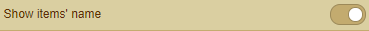

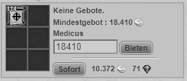

### Change layout to 3 items per line
- Changes the layout to 3 rows instead of 2

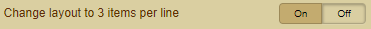

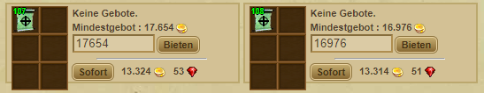
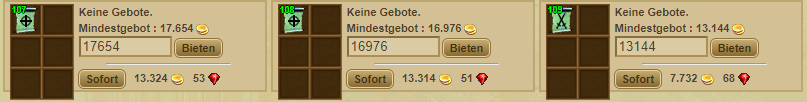

### Bid many items without page refresh
- Auctioning of items is carried out without a new refresh of the browser page

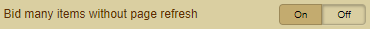

 

### Show extra stats on item images
- This basically work only for food items. The first number is the heal points that each food item recovers, and the second number inside the parenthesis is the number of heal points for each gold (= heal / bid price), hence, the higher that value, the cheaper the items is.

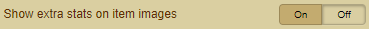

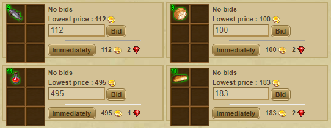 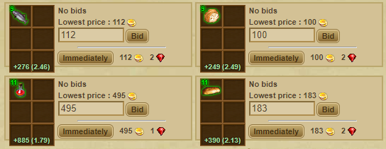

### Implemented auction save search and load it by default
- Saves the sorting setting that was last called up and calls it up again by default

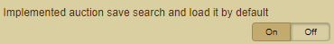

 
