## Index

- [Ignore attack confirmations](Documentation%20Arena.md#ignore-attack-confirmations)
- [Show an image-link to the simulator](Documentation%20Arena.md#show-an-image-link-to-the-simulator)
- [Sort players in arena by level](Documentation%20Arena.md#sort-players-in-arena-by-level)
- [Highlight players on other servers that may be guild members](Documentation%20Arena.md#highlight-players-on-other-servers-that-may-be-guild-members)
- [Players target list](Documentation%20Arena.md#players-target-list)

## Data
### Export settings to file
- Export your Addon settings to a file on your Computer

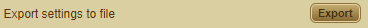

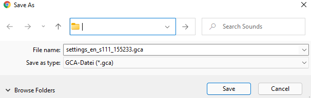

### Import settings from file
- Import your Addon settings from a file on your Computer 

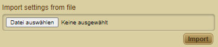

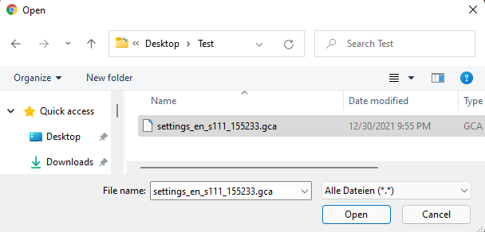

### Export settings to notes
- Export your Addon settings and your [Players target list](Documentation%20Arena.md#players-target-list) to the Gladiatus notes
- Before exporting, pay attention to the available characters in the Notes (Notes max 16.000 Characters)
- Do not change the Code between { }

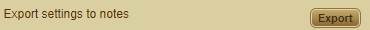

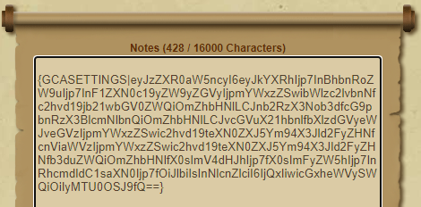

### Import settings from notes
- Import your Addon settings from your Gladiatus Notes

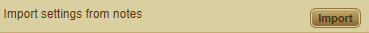

### Reset addon's settings
- Restores the default setting of the addon
- All adapt settings will be reset!

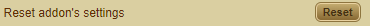

### Clear all addon's data
- Clear the Addon Data (Target List, Language Selection,...)

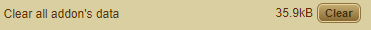

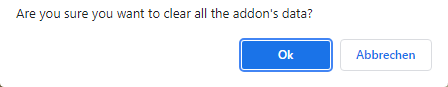

### Clear addon's temporal data (cache)
- Clear the Addon Data Cache 

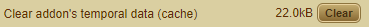

