## Index
- [[Forge/Repair] Show packages & market shortcuts for each material need](Documentation%20Forge.md#forgerepair-show-packages--market-shortcuts-for-each-material-need)
- [[Forge] Show Prefix/Sufix/Base item levels next to names](Documentation%20Forge.md#forge-show-prefixsufixbase-item-levels-next-to-names)
- [[Horreum] Show material name](Documentation%20Forge.md#horreum-show-material-name)
- [[Horreum] Remember last selected store settings](Documentation%20Forge.md#horreum-remember-last-selected-store-settings)
- [[Horreum] Select material on click](Documentation%20Forge.md#horreum-select-material-on-click)

## Forge
### [Forge/Repair] Show packages & market shortcuts for each material need
- Displays a total of 3 shortcuts (⧉ | ⚖ | ✉)   as an aid for the required material
- ⧉ - Link to package and filter items that contain the required material 
- ⚖ - Link to market and filter items that contain the required material
- ✉ - Link inserts the required material as content for a guild mail

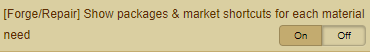

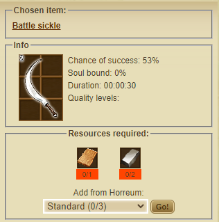
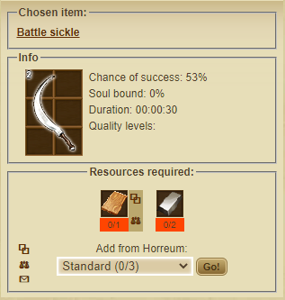

### [Forge] Show Prefix/Sufix/Base item levels next to names
- Show levels next to the labels

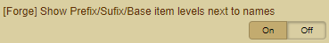

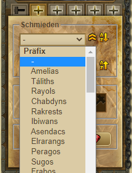
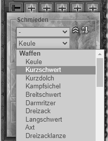
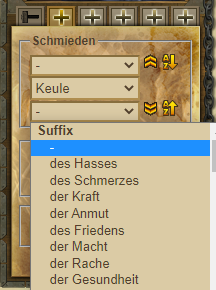

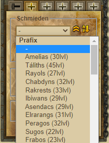
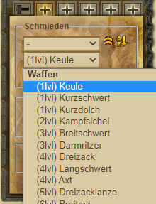
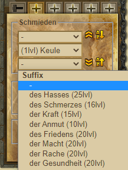

### [Horreum] Show material name
- Shows in addition to the raw material in addition commodity name

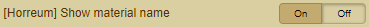

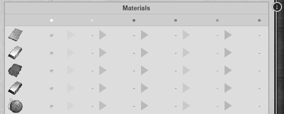
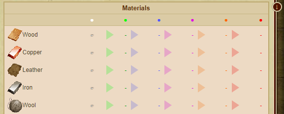

### [Horreum] Remember last selected store settings
- Saves the setting of "Store resources" and calls them as default

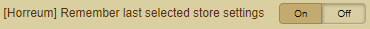

 

### [Horreum] Select material on click
- Select the required raw material by clicking on it

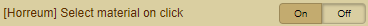

 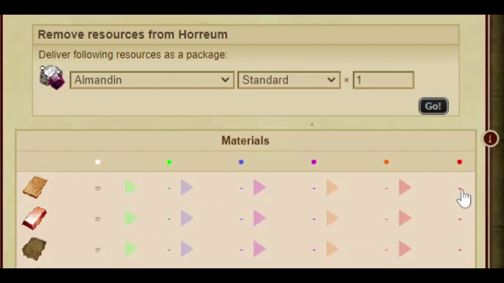
