## Index
- [Select Addon language](Documentation%20Global.md#select-addon-language)
- [Enable Sound](Documentation%20Global.md#enable-sound)
- [Enable Browser Notifications](Documentation%20Global.md#enable-browser-notifications)
- [Display extended HP and XP Header Info](Documentation%20Global.md#display-extended-hp-and-xp-header-info)
- [Display Life Potion Use Icon](Documentation%20Global.md#display-life-potion-use-icon)
- [Display minutes left to full Heal](Documentation%20Global.md#display-minutes-left-to-full-heal)
- [Enable the Shortcuts-Bar](Documentation%20Global.md#enable-the-shortcuts-bar)
- [Display Auction Statusbar](Documentation%20Global.md#display-auction-statusbar)
- [Alert when Auction Status changes](Documentation%20Global.md#alert-when-auction-status-changes)
- [Enable Top Fix-Bar](Documentation%20Global.md#enable-top-fix-bar)
- [Improve main menu](Documentation%20Global.md#improve-main-menu)
- [Submenu change on click](Documentation%20Global.md#submenu-change-on-click)
- [Remember Merchants Tabs](Documentation%20Global.md#remember-merchants-tabs)
- [Show attacked timers](Documentation%20Global.md#show-attacked-timers)
- [Show quests status or timer](Documentation%20Global.md#show-quests-status-or-timer)
- [Show merchants timer indicator](Documentation%20Global.md#show-merchants-timer-indicator)
- [Show forge/smelt timer indicator](Documentation%20Global.md#show-forgesmelt-timer-indicator)
- [Enable cooldowns sounds notifications (expedition, dungeon, arena)](Documentation%20Global.md#enable-cooldowns-sounds-notifications-expedition-dungeon-arena)
- [Notify me when there is a new guild application](Documentation%20Global.md#notify-me-when-there-is-a-new-guild-application)
- [Notify me when guild war attack cooldown](Documentation%20Global.md#notify-me-when-guild-war-attack-cooldown)
- [Enable gladiatus horizontal scroll](Documentation%20Global.md#enable-gladiatus-horizontal-scroll)
- [Enable items shadows](Documentation%20Global.md#enable-items-shadows)
- [Group inventory options](Documentation%20Global.md#group-inventory-options)
- [Show inventory items' price](Documentation%20Global.md#show-inventory-items-gold-price)
- [Change pages-box's layout](Documentation%20Global.md#change-pages-boxs-layout)
- [Show gold and exp data](Documentation%20Global.md#show-gold-and-exp-data)
- [Display pray shortcut when in Underworld](Documentation%20Global.md#display-pray-shortcut-when-in-underworld)
- [Display Centurio & PowerUps timers on Premium button](Documentation%20Global.md#display-centurio--powerups-timers-on-premium-button)
- [Display durability on item's bottom-left corner](Documentation%20Global.md#display-durability-on-items-bottom-left-corner)
- [Display item's forge materials on tooltips](Documentation%20Global.md#display-items-forge-materials-on-tooltips)
- [Display mercenaries real names (type) on tooltips](Documentation%20Global.md#display-mercenaries-real-names-type-on-tooltips)
- [Display Global Arena timer](Documentation%20Global.md#display-global-arena-timer)

## Global

### Select Addon language
 - Choose your preferred language from various pre-installed language packs.

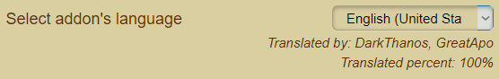

 - Missing translations can be displayed with the help tool "Missing translation".

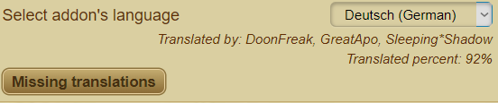
 
 - More Links: [Submit GCA translations](https://github.com/DinoDevs/GladiatusCrazyAddon/blob/master/documentation/translators/README.md)

### Enable Browser Notifications

 - Activate / deactivate the notifications via the browser.

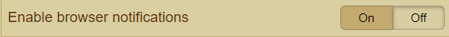
 - This notification must be explicitly permitted via the browser.

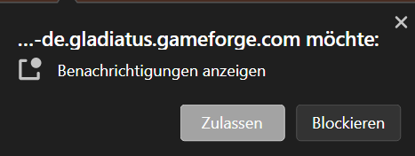
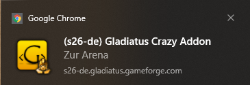
### Display extended HP and XP Header Info
 - Displays improved healthpoint and experience information
 
 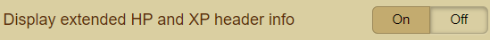
 
 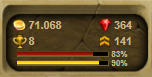 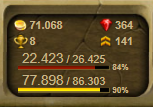
 
### Display Life Potion Use Icon
- Activate Healing Potion Icon for one-click use
- For this feature you have to have activated the following features "[Display extended HP and XP Header Info](Documentation%20Global.md#display-extended-hp-and-xp-header-info)"

 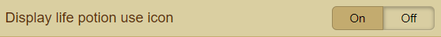
 
 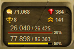 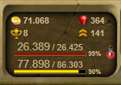

### Display minutes left to full Heal
- Shows remaining time until complete healing (life points)

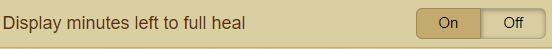

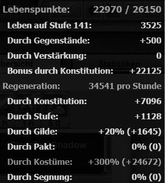 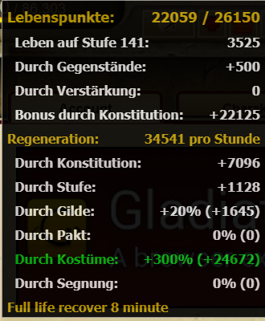

### Enable the Shortcuts-Bar
- Activates a quick access bar to various buildings or reports

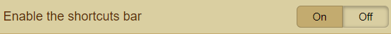

- After activation, symbols can be used to select quick access to buildings / reports.

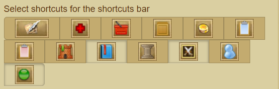

*Explanation of the symbols:*
--	Write guild message
--	Go to guild's medic center
--	Go to guild's market
--	Go to guild's storage
--	Go to guild's bank
--	Go to guild's war camp
--	Go to guild's arena battle reports
--	Go to guild's jail
--	Go to guild's library
--	Go to guild's temple
--	Display my stats
--	Display online players

- These are then displayed as a quick access bar

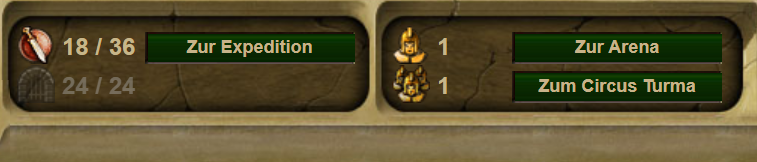
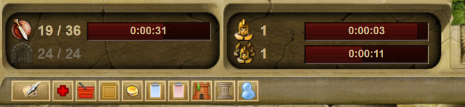

### Display Auction Statusbar
- Shows the remaining duration of the two auction houses (gladiator needs / mercenary needs)

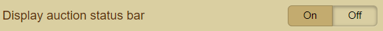
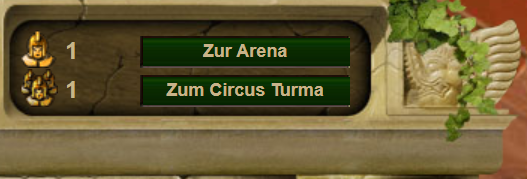
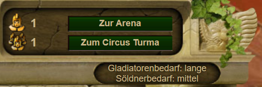

### Alert when Auction Status changes
- Informed about a change of status at the two auction houses (gladiator needs / mercenary needs)

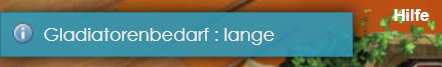

### Enable Top Fix-Bar
- Freezes a navigation bar at the top of the screen when scrolling

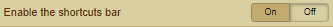
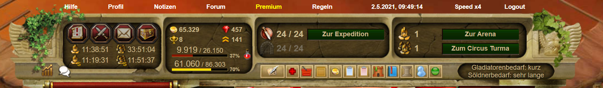
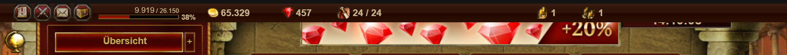

### Improve main menu
- Improves the main menu "Overview" and "Guild" 

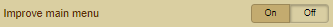

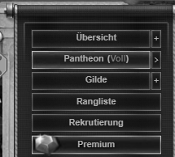 
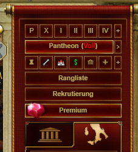 

### Submenu change on click
- Change submenu by clicking

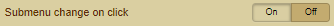

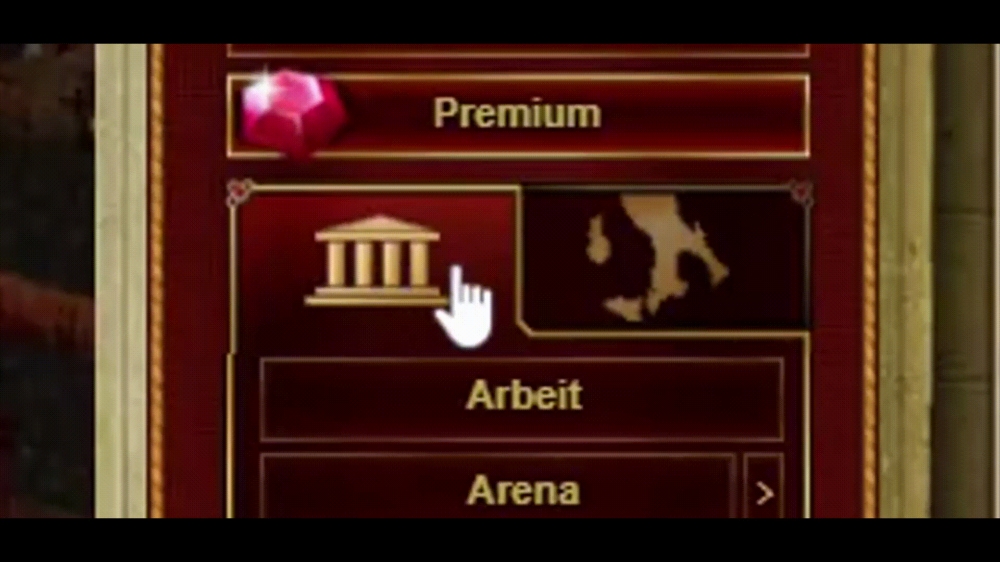 

### Remember Merchants Tabs
- Saves the previously visited tab at the merchants and calls it up.

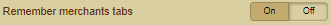

 

### Show attacked timers
- These timers show the time passed since you have been attacked.

Top left: Arena
Top right: Turma
Bottom left: Cross Server
Bottom right: Cross Server Turma

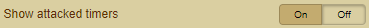

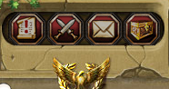
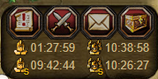

### Show quests status or timer
- Shows the status or the timer of the running Quest.

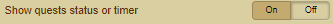

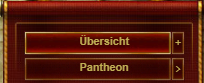
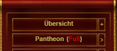

### Show merchants timer indicator
- This is green where there are new items available (merchants have been reset) else it’s red. On mouse over it shows a timer to the next reset.

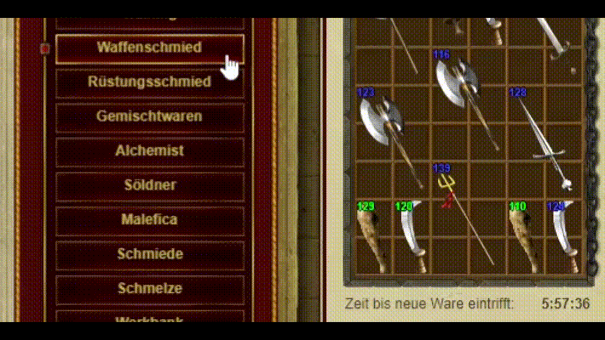

### Show forge/smelt timer indicator
- When you smelt or forge items, this indicator will appear. If it is green, an item is ready, else it is red. On mouse over it shows all item timers until they finish.

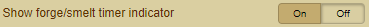

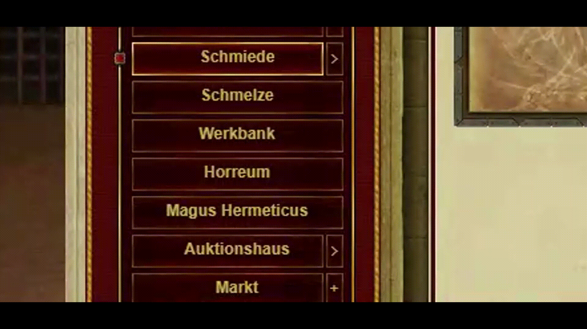

### Enable cooldowns sounds notifications (expedition, dungeon, arena)
-	Activates a sound notification as soon as the timer for expeditions / dungeons or arenas has expired.
-	Provided that the sound setting under "Sound - Enable sound system" is activated.

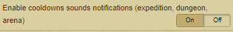

### Notify me when there is a new guild application
-	Generates a notification (depending on the set time) as soon as a guild application is submitted.

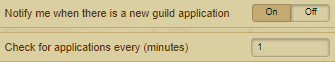

### Notify me when guild war attack cooldown
-	Generates a notification (depending on the set time) as soon as the cooldown time of the guild battle has expired

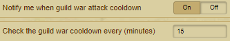

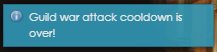

### Enable gladiatus horizontal scroll
- If you have a small browser window activate the feature to activate a horizontal scroll bar

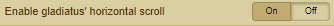

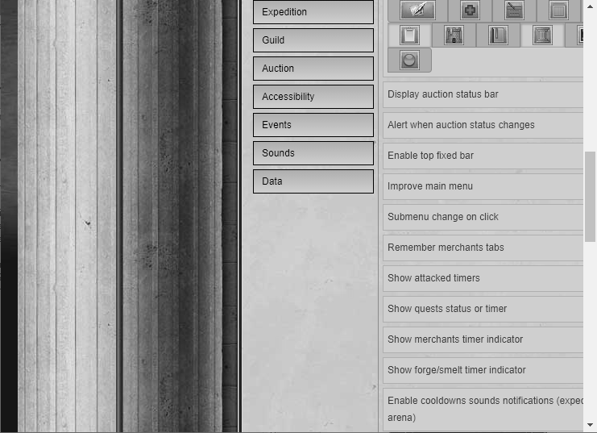
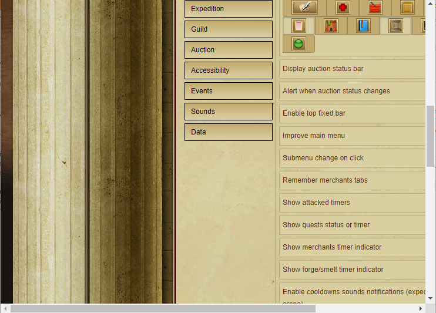

### Enable items shadows
-	Activates a shadow on the respective object

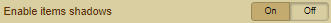

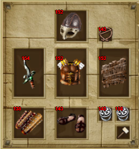
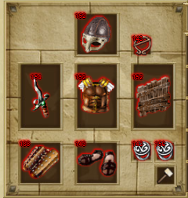

### Group inventory options
-	Groups the inventory options together

### Show inventory items gold price
-	Displays the gold inventory per inventory page

### Change pages-box's layout
-	Changes the view of the page numbering (messages, packages, ...)

### Show gold and exp data
-	Shows the gold and experience as a filterable overview

### Display pray shortcut when in Underworld
-	Displays a shortcut to the Pray button in the Underworld

### Display Centurio & PowerUps timers on Premium button
-	Displays timers for Centurio and Power Ups on the Premium button

### Display durability on item's bottom-left corner
-	Show the  Durability on Items
-	Possible displays are: "do not show" or "%" or "⚒"
-	If the durability of the item is less than 100%, the symbol changes to green. If the durability of the item is over 100%, the symbol changes to yellow
-	You can also set that a notification is generated when a set value is reached

### Display item's forge materials on tooltips
-	Shows the possible raw materials for the melt in the tooltip
-	Possible displays are: --	do not show -- next to one another -- one below the other -- next to one another with X -- or one below the other with X

### Display mercenaries real names (type) on tooltips
-	Shows the real name of the mercenary in the tooltip

### Display Global Arena timer
-	Show the international / global arena and fight gladiators from all around the world

