## Index
- [Improve jail's layout](Documentation%20Guild.md#improve-jails-layout)
- [Improve library's layout](Documentation%20Guild.md#improve-librarys-layout)
- [Fade items that are not scrolls on library](Documentation%20Guild.md#fade-items-that-are-not-scrolls-on-library)
- [Add more data on library's tooltips](Documentation%20Guild.md#add-more-data-on-librarys-tooltips)
- [Improve bank's donate layout](Documentation%20Guild.md#improve-banks-donate-layout)
- [Improve bank's book layout](Documentation%20Guild.md#improve-banks-book-layout)
- [Show donation variations since last visit on bank's book](Documentation%20Guild.md#show-donation-variations-since-last-visit-on-banks-book)
- [Improve medic's layout](Documentation%20Guild.md#improve-medics-layout)

## Guild
### Improve jail's layout
- Improves the layout of the Negotium X building

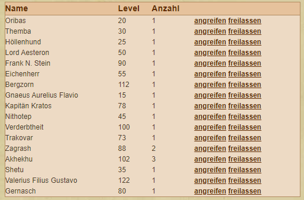
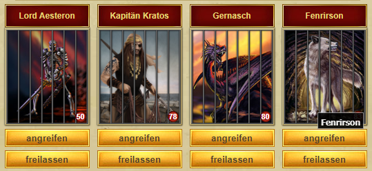

### Improve library's layout
- Improves the layout of the Library building

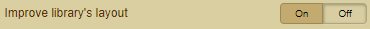

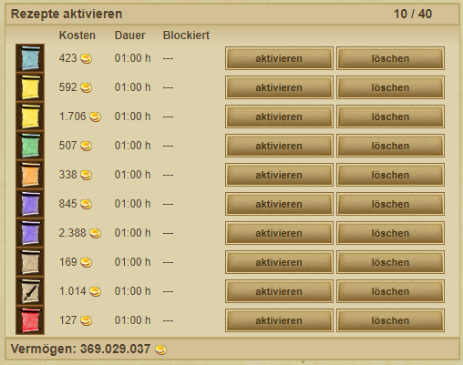
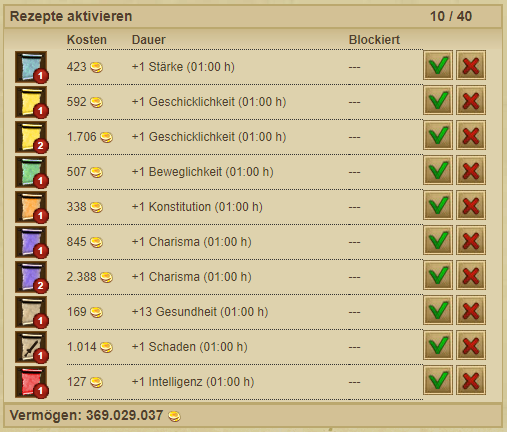

### Fade items that are not scrolls on library
- Hides items that cannot be added to the library

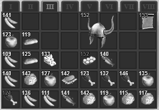
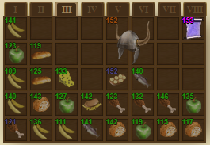

### Add more data on library's tooltips
- Shows details of the recipes in the library

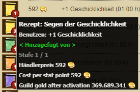

### Improve bank's donate layout
- Improve the layout of the bank donation
- Added donate all your gold button
- Changed link to donations book for faster loading (will only show detailed donation from the last 2 days)

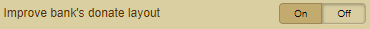

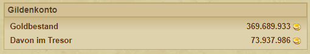
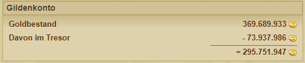

### Improve bank's book layout
- Improve the layout of the bank book
- Shows total gold spend on upgrades, total donated gold & stolen gold
- Highlight your player in the donations list
- Shows donations of each player since last visit

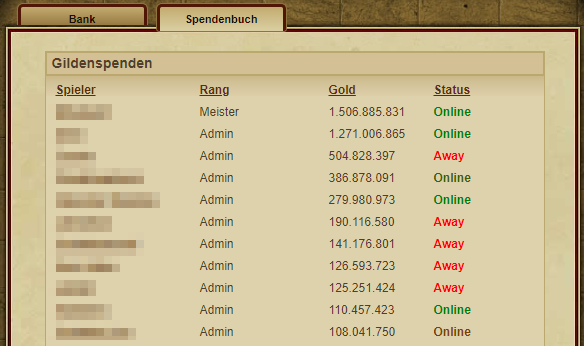
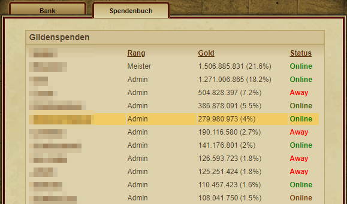

### Show donation variations since last visit on bank's book
- Show the donation difference of the players since the last donation book visit

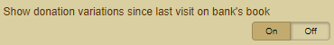

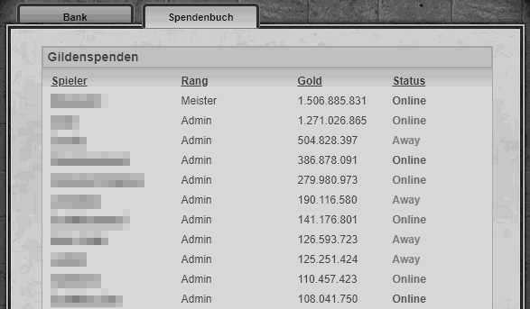
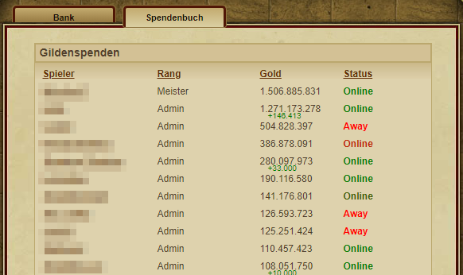

### Improve medic's layout
- Improve the layout of the Vila Medici building

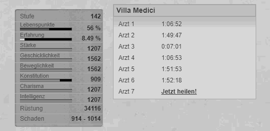
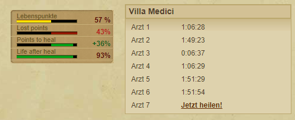
