## Index
- [Buy confirmation on soul-bound items](Documentation%20Market.md#buy-confirmation-on-soul-bound-items)
- [Buy confirmation on items that cost 1 gold](Documentation%20Market.md#buy-confirmation-on-items-that-cost-1-gold)
- [Show cancel-all button](Documentation%20Market.md#show-cancel-all-button)
- [Remember last chosen sell duration](Documentation%20Market.md#remember-last-chosen-sell-duration)
- [Select default sell duration](Documentation%20Market.md#select-default-sell-duration)
- [Toggle button changing sell price always to 1 gold](Documentation%20Market.md#toggle-button-changing-sell-price-always-to-1-gold)
- 
- [Remember last sort order](Documentation%20Market.md#remember-last-sort-order)
- [Select item with double click](Documentation%20Market.md#select-item-with-double-click)
- [Warning icon when selling items](Documentation%20Market.md#warning-icon-when-selling-items)
- [Sell items by pressing ENTER ⏎](Documentation%20Market.md#sell-items-by-pressing-enter-)

## Market
### Buy confirmation on soul-bound items
- When buying a soulbound item, a confirmation message is issued

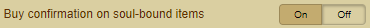

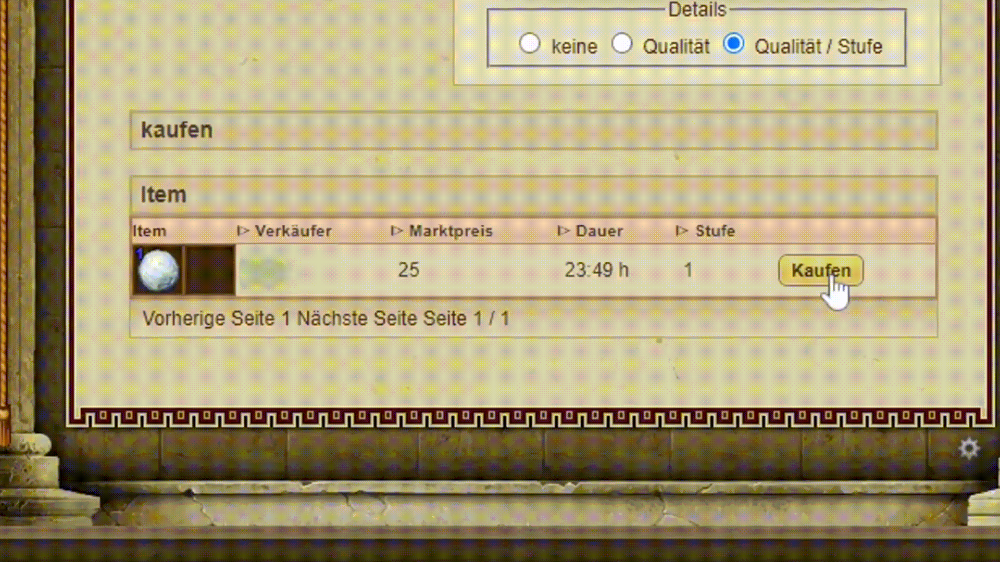 

### Buy confirmation on items that cost 1 gold
- When buying an item which costs 1 gold is issued a confirmation message

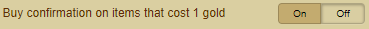

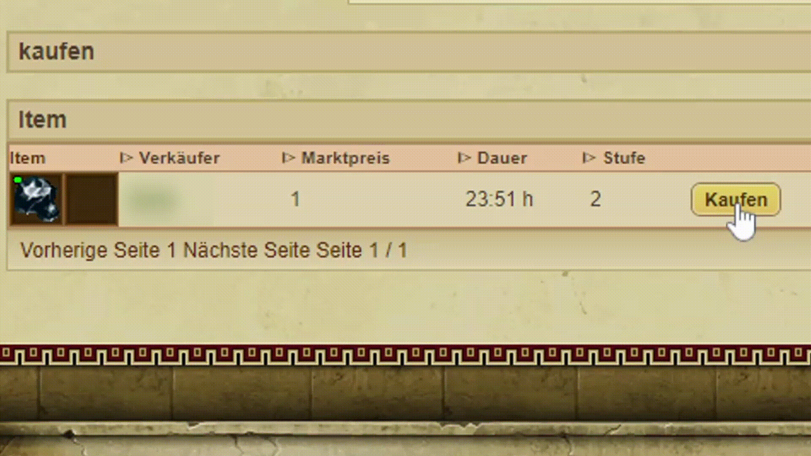 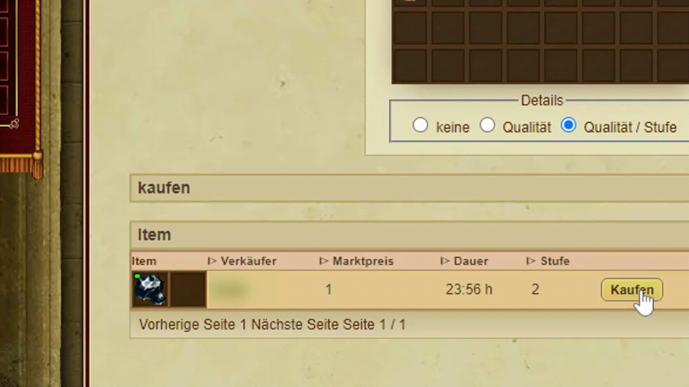

### Show cancel-all button
- Shows a button with which all items offered in the market can be canceled

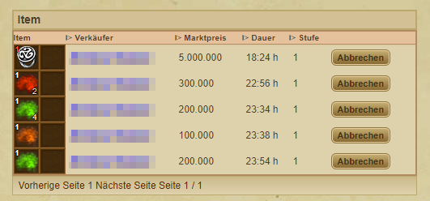 
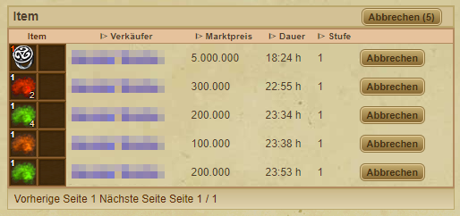

### Remember last chosen sell duration
- Remembers the last set sales period and uses this as the default

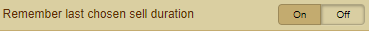

 

### Select default sell duration
- Choose a preferred offer duration (2h, 8h, 24h or 48h) which taken as default

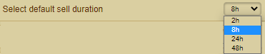

### Toggle button changing sell price always to 1 gold
- Set the button for every item that is sold to 1 gold

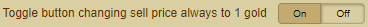

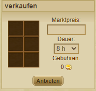
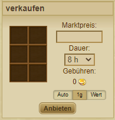

### Custom market prices
- Add custom market price for a quick sale
- Separate values with commas (100.000, 50000, 150%)
- Sale base on percentage of the item's price by adding an "%"

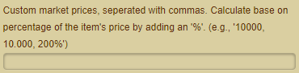

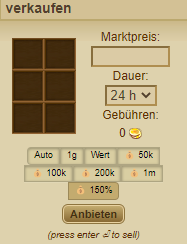

For Example:
- Sell an item for 50% more and type "150%" as custom price.
- Base is 2358 Gold --> **3537 Gold**

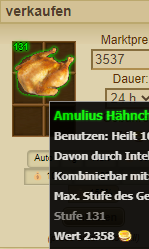

### Remember last sort order
- Saves the previously used sorting and uses it as the default

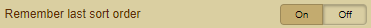

 

### Select item with double click
- Select items by double-clicking them

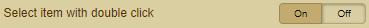

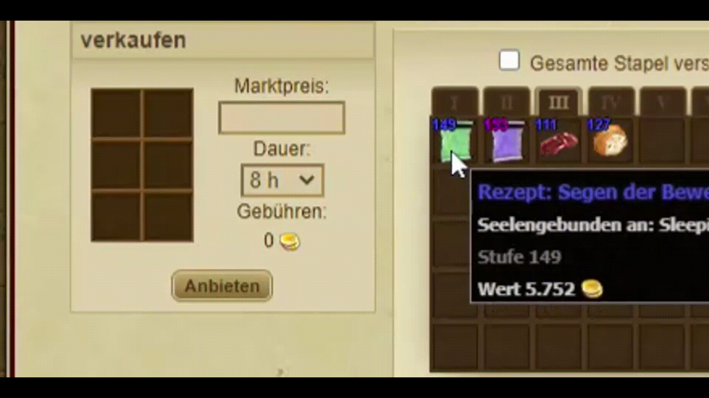 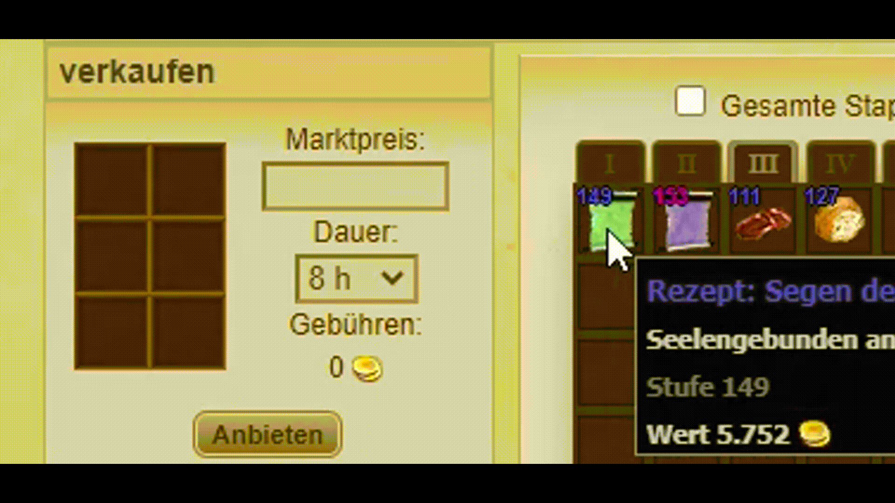

### Warning icon when selling items
- Show warning symbols when selling, for example, soulbound items
- 🔗 Sale of a soulbound item
- ♺ Sale of a high level item and you won't be able to buy it back from another player

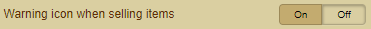

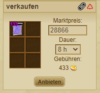

### Sell items by pressing ENTER ⏎
- Sell items using the Enter key

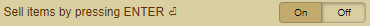

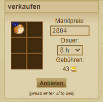
