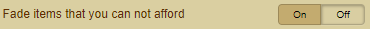
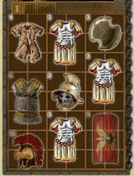
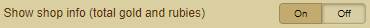
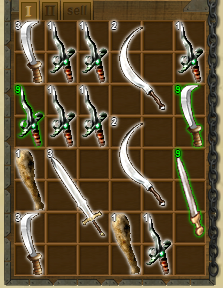
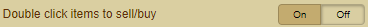

## Index
- [Fade items that you can not afford](Documentation%20Merchants.md#fade-items-that-you-can-not-afford)
- [Show shop info (total gold and rubies)](Documentation%20Merchants.md#show-shop-info-total-gold-and-rubies)
- [Double click items to sell/buy](Documentation%20Merchants.md#double-click-items-to-sellbuy)

## Merchants
### Fade items that you can not afford
- Not affordable items are displayed pale

## Show shop info (total gold and rubies)
- Displays the total value per merchants (gold and rubies)

## Double click items to sell/buy
- Buy / sell items at the merchants with a double click

 
