## Index
- [Improve messages layout](Documentation%20Messages.md#improve-messages-layout)
- [Highlight unread messages](Documentation%20Messages.md#highlight-unread-messages)
- [Separate messages from different days](Documentation%20Messages.md#separate-messages-from-different-days)
- [Enable send message box](Documentation%20Messages.md#enable-send-message-box)
- [Show more guild mates info](Documentation%20Messages.md#show-more-guild-mates-info)
- [Show links included on messages](Documentation%20Messages.md#show-links-included-on-messages)
- [Auto load guild battle results](Documentation%20Messages.md#auto-load-guild-battle-results)
- [Show messages sidebar](Documentation%20Messages.md#show-messages-sidebar)
- [Focus on message body](Documentation%20Messages.md#focus-on-message-body)
- [Fix messages title link click bug](Documentation%20Messages.md#fix-messages-title-link-click-bug)
- [Enable select friend from list button](Documentation%20Messages.md#enable-select-friend-from-list-button)

## Messages
### Improve messages layout
- Improves the message layout with shortlinks

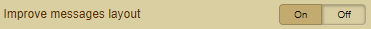

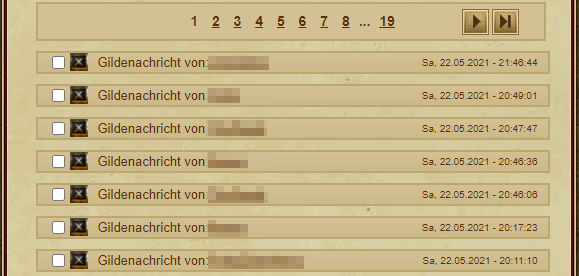
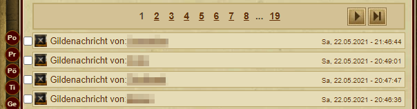

### Highlight unread messages
- Highlight all unread messages

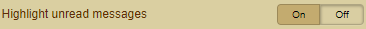

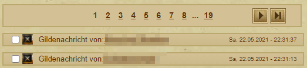
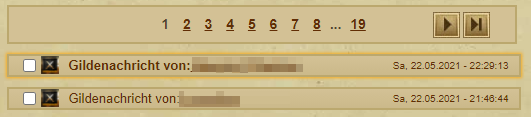

### Separate messages from different days
- Split all your messages in different days

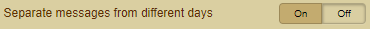

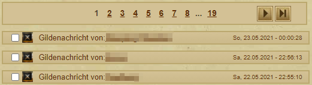
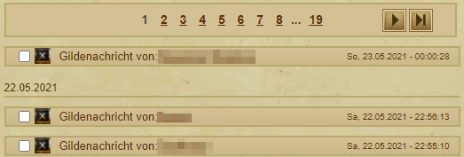

### Enable send message box
- Under construction - Ticket on Github

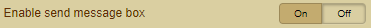

### Show more guild mates info
- Shows also the respective guild rank next to the name

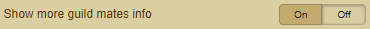

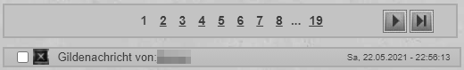
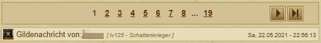

### Show links included on messages
- If a message contains a link, this is explicitly displayed and can be opened with a click

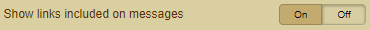

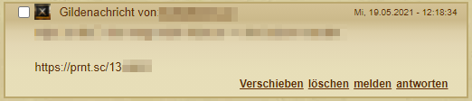
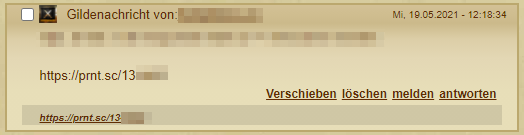

### Auto load guild battle results
- Displays the complete result of a guild battle as a message

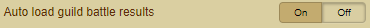

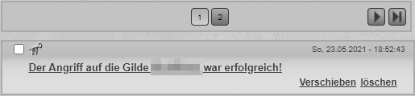
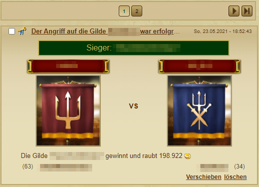

### Show messages sidebar
- Shows a summary per page via icon of how many messages, guild fights, ... are available

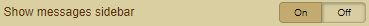

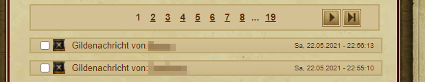
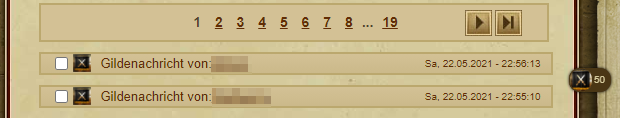

### Focus on message body
- When entering a private message, the cursor moves to the "Messages" field instead of the "Subject" field

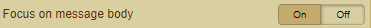

 

### Fix messages title link click bug
- Under construction - Ticket on Github

### Enable select friend from list button
- When writing a private message, you can select guild mates or friends directly

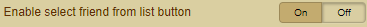

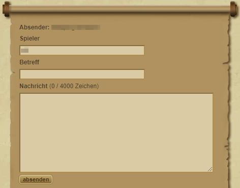 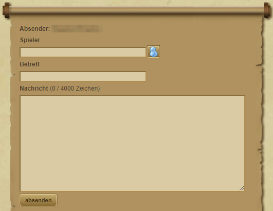 
