## Index
- [Analyze items stats (needed for training)](Documentation%20Overview.md#analyze-items-stats-needed-for-training)
- [Show life gain from foods](Documentation%20Overview.md#show-life-gain-from-foods)
- [Show block and Avoid caps](Documentation%20Overview.md#show-block-and-avoid-caps)
- [Highlight best food](Documentation%20Overview.md#highlight-best-food)
- [Fade foods that will over-heal you](Documentation%20Overview.md#fade-foods-that-will-over-heal-you)
- [Double click items to consume them](Documentation%20Overview.md#double-click-items-to-consume-them)
- [Log daily bonus](Documentation%20Overview.md#log-daily-bonus)
- [Show detailed timers on guild buffs](Documentation%20Overview.md#show-detailed-timers-on-guild-buffs)
- [Show mercenaries manager](Documentation%20Overview.md#show-mercenaries-manager)
- [Show mercenaries tooltips](Documentation%20Overview.md#show-mercenaries-tooltips)
- [Show more stats on statistics tab](Documentation%20Overview.md#show-more-stats-on-statistics-tab)
- [Enhance achievements layout](Documentation%20Overview.md#enhance-achievements-layout)
- [Enhance costumes layout](Documentation%20Overview.md#enhance-costumes-layout)
- [Show needed-materials-to-repair box](Documentation%20Overview.md#show-needed-materials-to-repair-box)

## Overview
### Analyze items stats (needed for training)
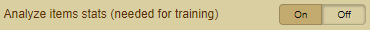

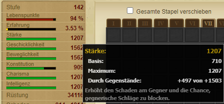
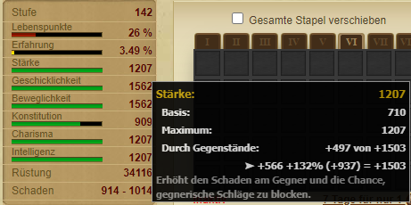

### Show life gain from foods
- Shows the current healing gain from the item

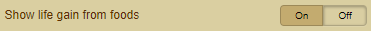

 

### Show block and Avoid caps
- The first number is the points you have and the second the points you need to reach the max stat (25% avoid hit, 50% block, 50% critical)
- When it is green, you have reach the maximum of that stat. When it is red, the cap hasn’t been reached yet.

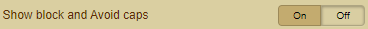

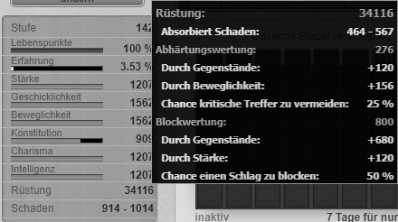
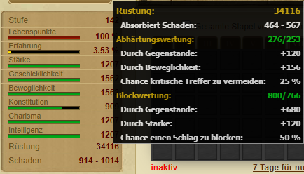
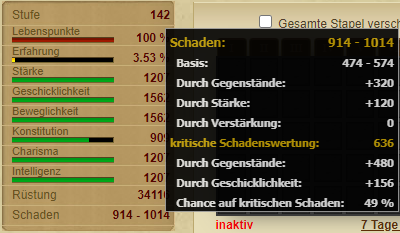
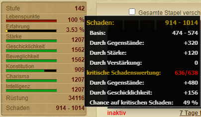

### Highlight best food
- Highlights the best food for use

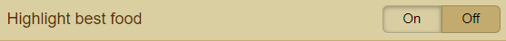

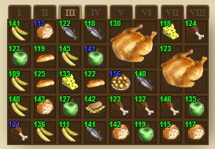
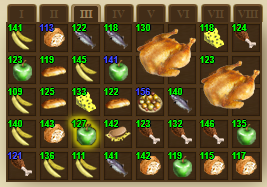

### Fade foods that will over-heal you
- Fade the food that is causing too much healing (over 100%)

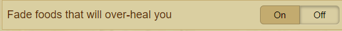

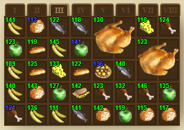
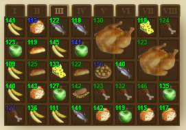

### Double click items to consume them
- Use the double click to consume food

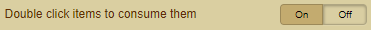

 

### Log daily bonus
- Logs the daily login bonus
- Feature must be activated before using the login bonus in order to add a log

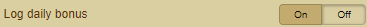

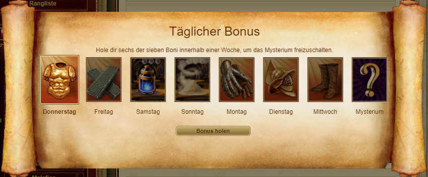

### Show detailed timers on guild buffs
- Shows the remaining time of buffs (from the guild library) above your character. 

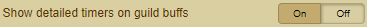

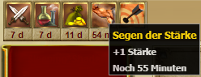
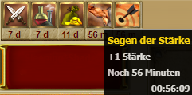

### Show mercenaries manager
- Activates an overview of all mercenaries in order to assign the task to each mercenary

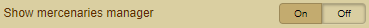

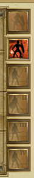 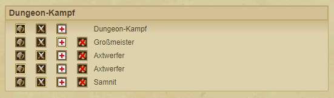

### Show mercenaries tooltips
- Shows alos the mercenary icon with a tooltip in the individual mercenaries

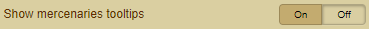

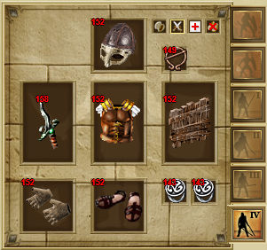
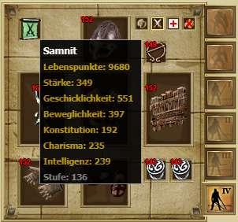

### Show more stats on statistics tab
- Shows detailed statistics of the players (Difference)

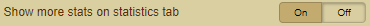

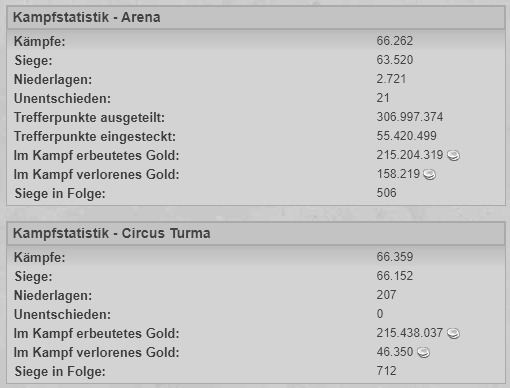
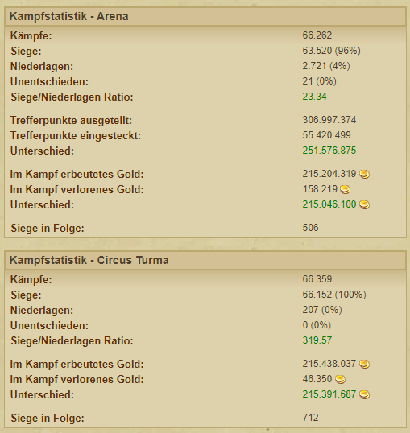

### Enhance achievements layout
- Show a detailed overview of the achievements (Progress bar)

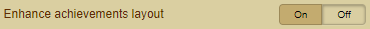

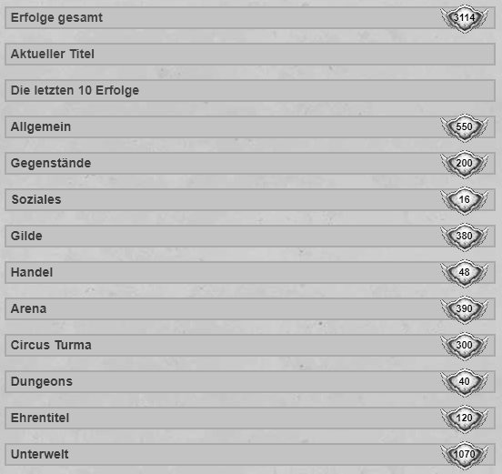
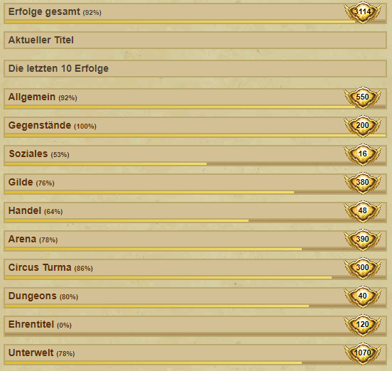

### Enhance costumes layout
- Show a detailed overview of the costumes

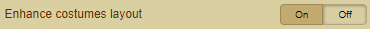

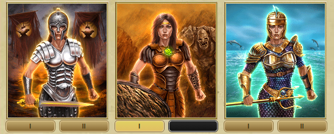 
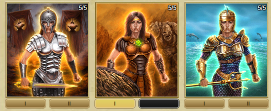

### Show needed-materials-to-repair box
- Shows a "repair box" to determine which and how many raw materials are needed to repair the item

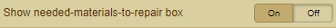

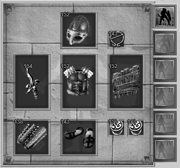
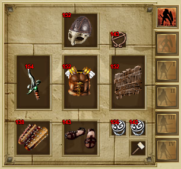

