## Index
- [Enhance filters layout](Documentation%20Packages.md#enhance-filters-layout)
- [Make info layout compact](Documentation%20Packages.md#make-info-layout-compact)
- [Improve items layout](Documentation%20Packages.md#improve-items-layout)
- [Make items small in size](Documentation%20Packages.md#make-items-small-in-size)
- [Load more pages](Documentation%20Packages.md#load-more-pages)
- [Show items' price](Documentation%20Packages.md#show-items-price)
- [Enable special features per category](Documentation%20Packages.md#enable-special-features-per-category)
- [Double click packets to open them](Documentation%20Packages.md#double-click-packets-to-open-them)
- [Advance packages filters](Documentation%20Packages.md#advance-packages-filters)
- [Pop bag over on scroll](Documentation%20Packages.md#pop-bag-over-on-scroll)

## Packages
### Enhance filters layout
- Improves the filter layout

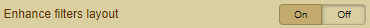

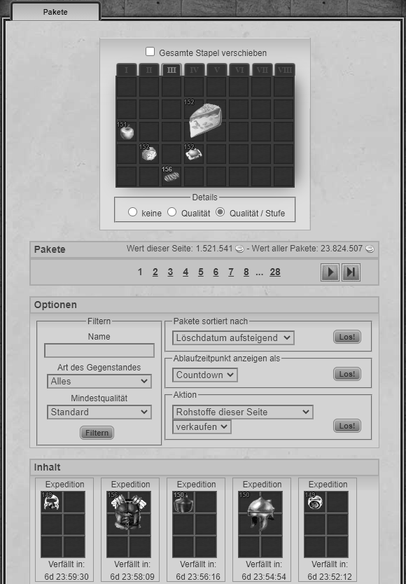 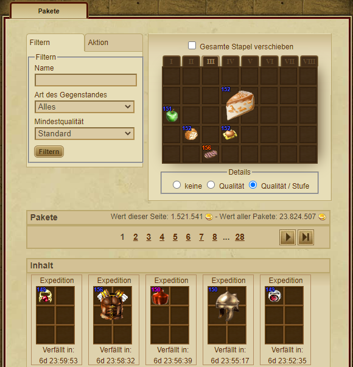

### Make info layout compact
- Slightly changes the spacing between the pages and the packages area

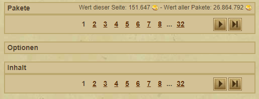
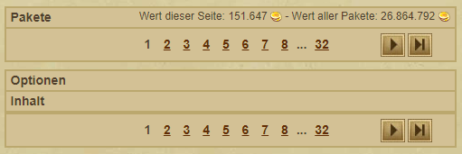
### Improve items layout
- Improve the items layout

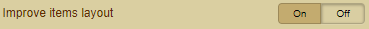

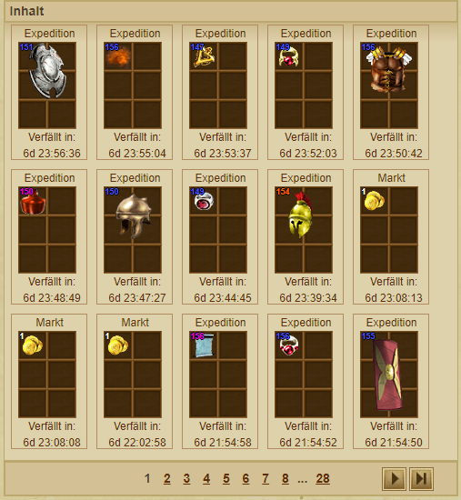 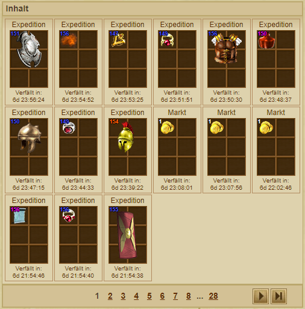

### Make items small in size
- Displays the items in the packages small

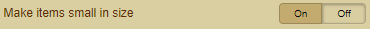

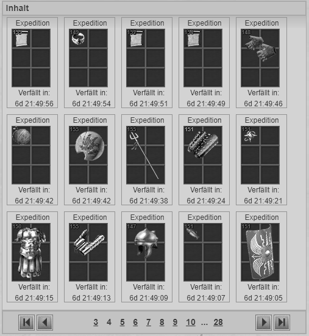 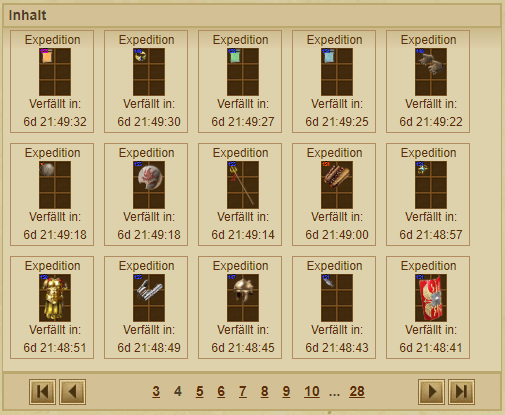

### Load more pages 
- Now you can choose the number of pages to load 

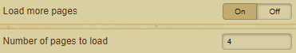

### Show items' price
- Show the price of the items

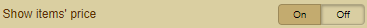

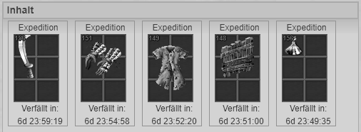

### Enable special features per category
- Enable special features at the packages
- Choose one of three different display options
- The features acitived "Show if scrolls are know/unknown" and 📜 "Show scroll icon item's prefix/suffix is unknown"

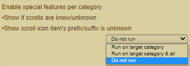

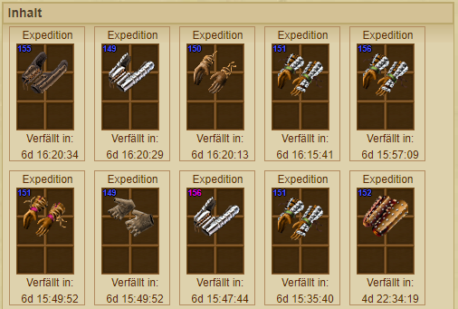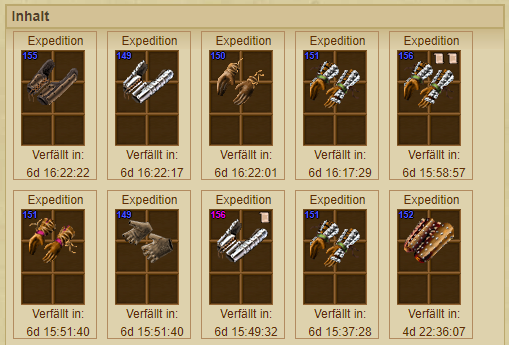

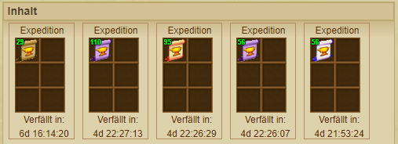

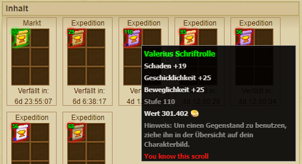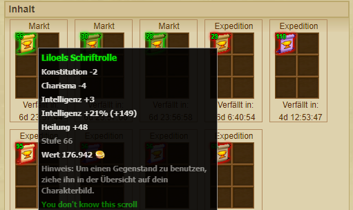

### Double click packets to open them
- Use the double click to open the packets

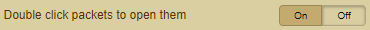

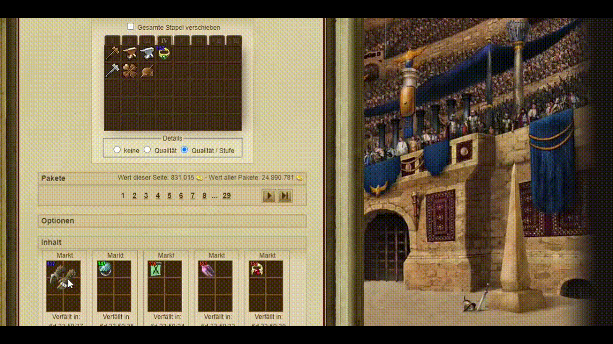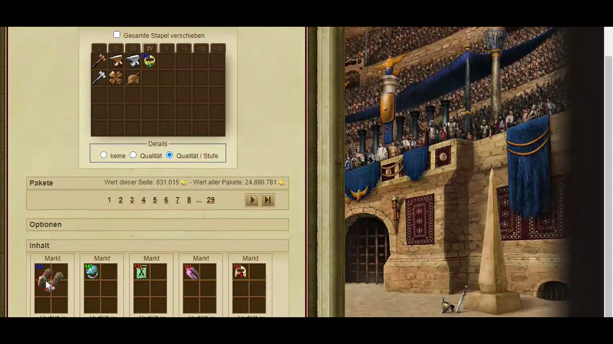

### Advance packages filters
- Activates a special filter for items

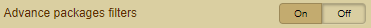

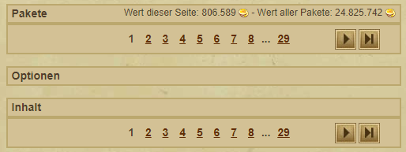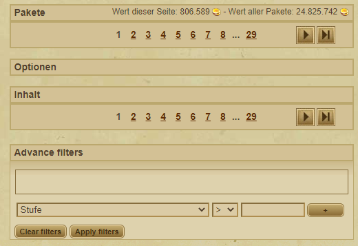

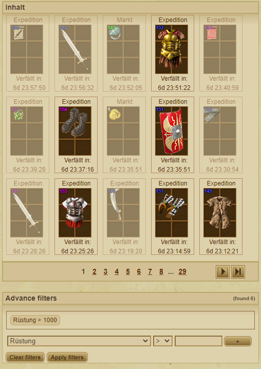

### Pop bag over on scroll
- Highlights the inventory and scrolls with it
- You can freely choose the position of the inventory with 

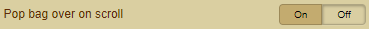

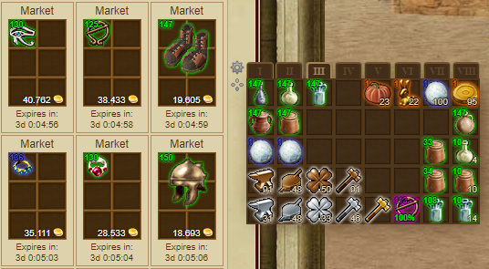
