## Index
- [Enable quest grouping](Documentation%20Pantheon.md#enable-quest-grouping)
- [Show detailed quests rewards](Documentation%20Pantheon.md#show-detailed-quests-rewards)
- [Show completed missions](Documentation%20Pantheon.md#show-completed-missions)
- [Show god points percent](Documentation%20Pantheon.md#show-god-points-percent)
- [Open multiple mystery boxes](Documentation%20Pantheon.md#open-multiple-mystery-boxes)
- [Show mystery-box reward's value in rubies](Documentation%20Pantheon.md#show-mystery-box-rewards-value-in-rubies)
- [Show mystery-box reward's owned amount](Documentation%20Pantheon.md#show-mystery-box-rewards-owned-amount)

## Pantheon
### Enable quest grouping
- Enables the grouping of quest

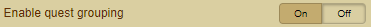

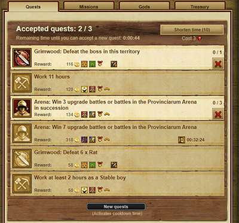
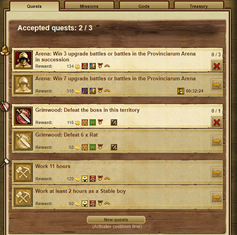

### Show detailed quests rewards
- Show detailed quests rewards (Gods, Honour,...)

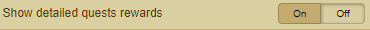

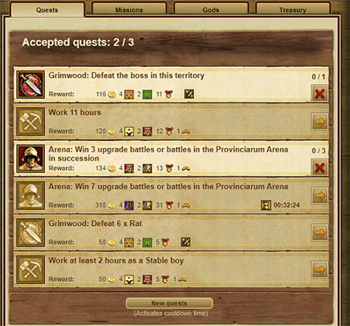

### Show completed missions
- Shows completed missions in a separate section and can be completed together

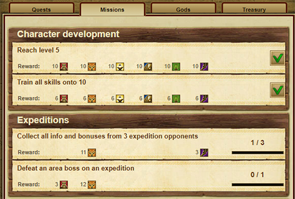
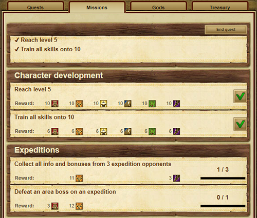

### Show god points percent
- Displays per God addition the gods points as a percent

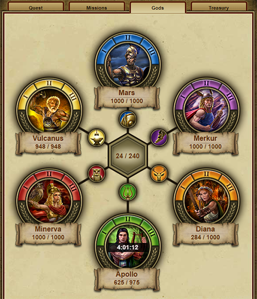
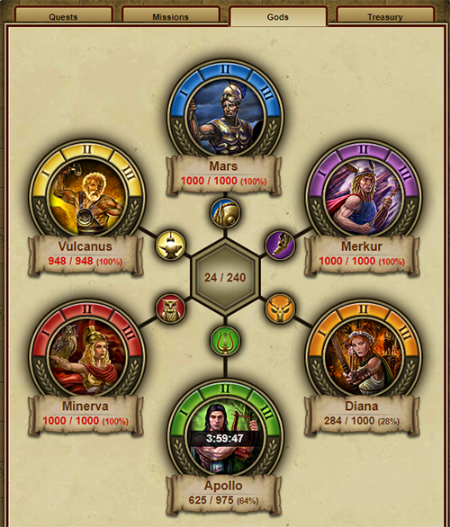

### Open multiple mystery boxes
- Open multiple mystery boxes at once

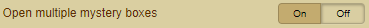

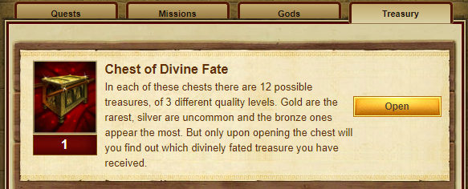
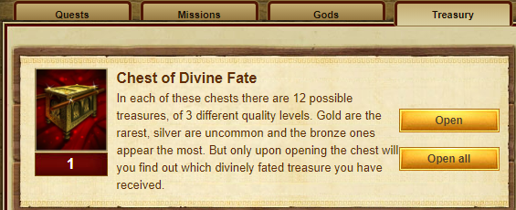

### Show mystery-box reward's value in rubies
- Show the value of the possible winnings in rubies

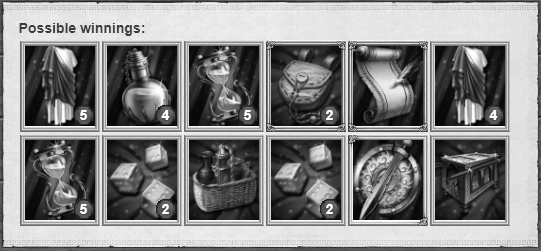
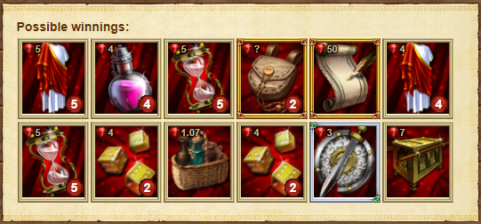

### Show mystery-box reward's owned amount
- Show your current inventory in addition to the possible winnings (rewards)

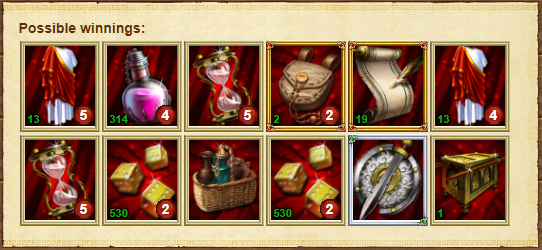
