## Index
- [Improve reports' list layout](Documentation%20Reports.md#improve-reports-list-layout)
- [Load each report's reward](Documentation%20Reports.md#load-each-reports-reward)
- [Gather data about found items](Documentation%20Reports.md#gather-data-about-found-items)
- [Analyze report and show life stats](Documentation%20Reports.md#analyze-report-and-show-life-stats)

## Reports
### Improve reports' list layout
- Improves the list layout of the reports (expedition, arena, ...)

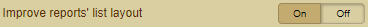

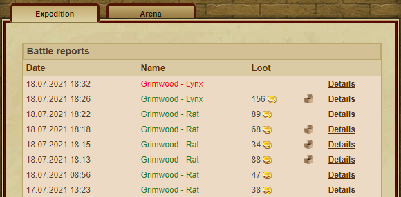
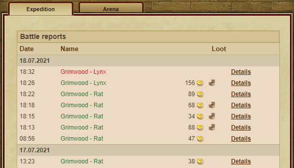
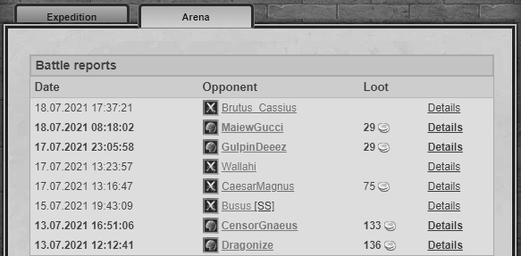
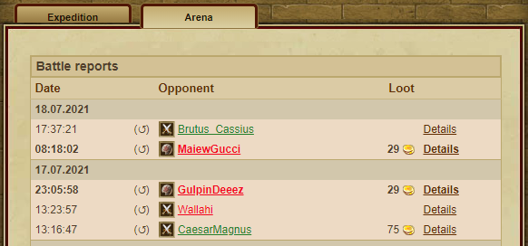

### Load each report's reward
- Shows the respective reward in the overview of the reports
- For this feature you have to have activated the following features "[Improve reports' list layout](Documentation%20Reports.md#improve-reports-list-layout)"

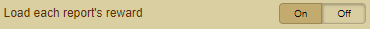

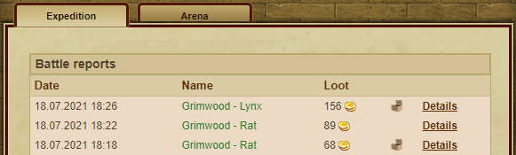
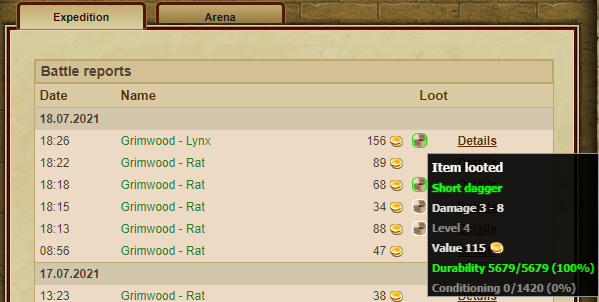

### Gather data about found items
- Work in progress

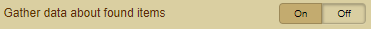

### Analyze report and show life stats
- The respective Turma report is analyzed and the life statistics are displayed

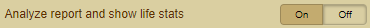

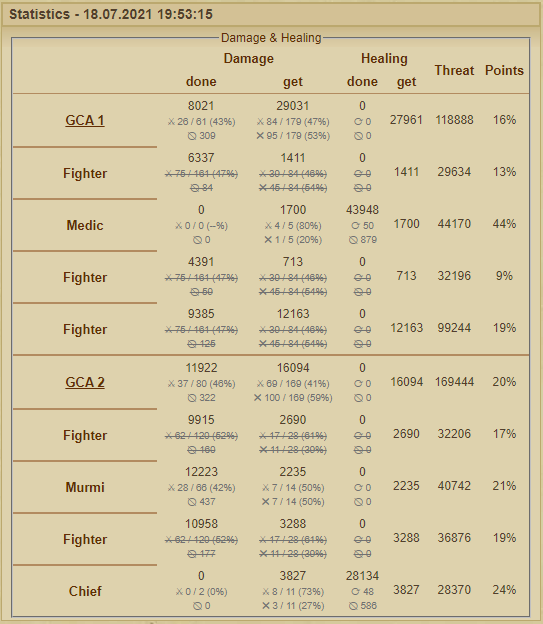
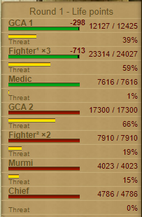
