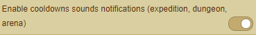

## Index
- [Fade items that you can not improve](Documentation%20Magus.md#fade-items-that-you-can-not-improve)

## Sounds
### Enable cooldowns sounds notifications (expedition, dungeon, arena)
- Activate to receive a sound notification for arenas, expeditions and dungeons
- When activated, a loudspeaker is displayed in the **lower right** browser window

### Mute/Unmute sounds
- Mute or Unmute your sound
- Use the loudspeaker to mute / unmute the sounds  

### Mute/Unmute sounds
- Adjust the volume

