## Index
- [Show training discount](Documentation%20Training.md#show-training-discount)
- [Show basics in bars](Documentation%20Training.md#show-basics-in-bars)
- [Enable multiple training](Documentation%20Training.md#enable-multiple-training)
- [Enable cost calculator](Documentation%20Training.md#enable-cost-calculator)
- [Show analyzed items data in tooltips](Documentation%20Training.md#show-analyzed-items-data-in-tooltips)
- [Show stat points after upgrade](Documentation%20Training.md#show-stat-points-after-upgrade)

## Training
### Show training discount
- Activates the possible training discount
- The training discount can depend on various factors (Training ground, Neptuns Costume, Micro events, Costume Events,...)

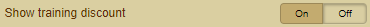

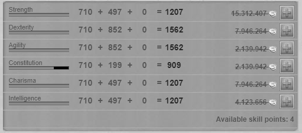
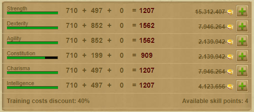

### Show basics in bars
- Shows the basic values as bars in different colors

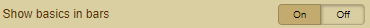

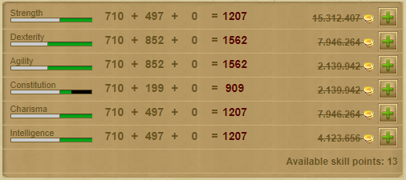

### Enable multiple training
- Enable multiple training per skill

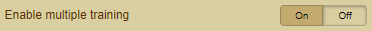

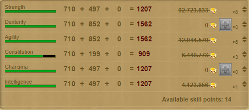

### Enable cost calculator
- Activates the cost calculator of all your skills with an adjustable training discount

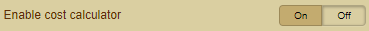

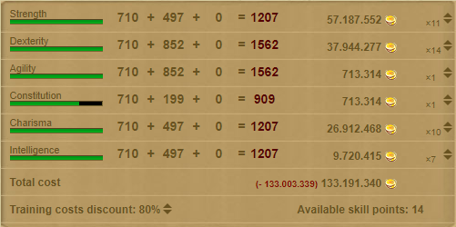

### Show analyzed items data in tooltips
- Displays the analyzed data of the items in the tooltip

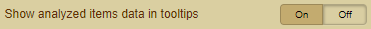

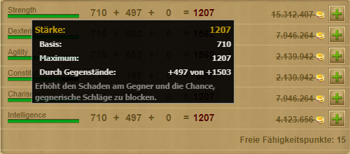
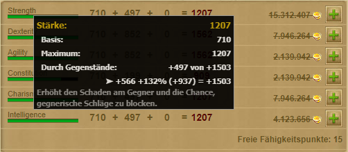

### Show stat points after upgrade
- Shows the new statistics after training (Stats Points, Points Breakdown)

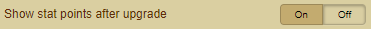

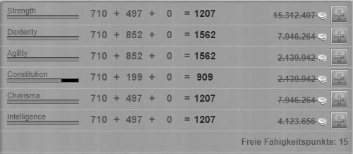
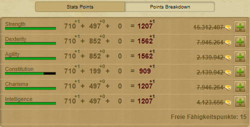
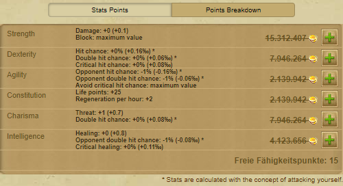

