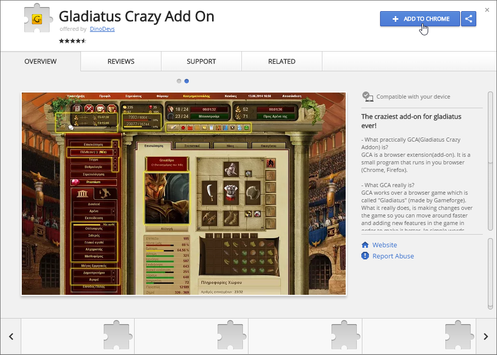
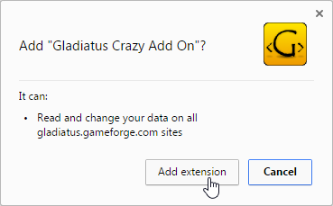
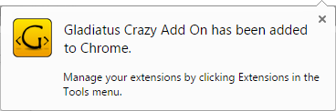
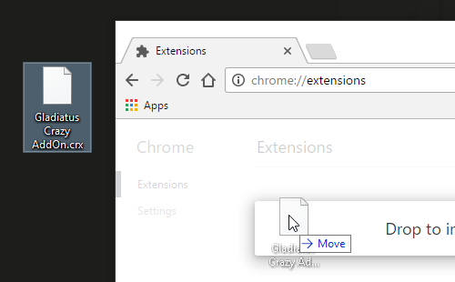
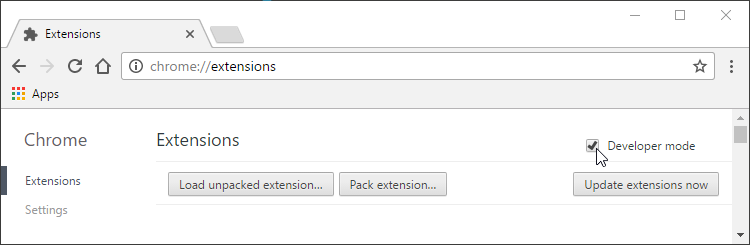
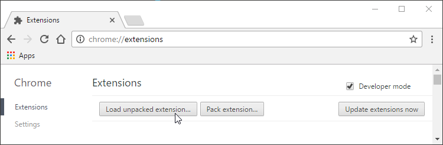

# Installation Documentation - Google Chrome

### How to install the addon on *Google Chrome* browser

- [Install from the *Google web store*](https://github.com/DinoDevs/GladiatusCrazyAddon) (recomended)
- [Install using the *.crx* extension file](https://github.com/DinoDevs/GladiatusCrazyAddon)
- [Install using the *.zip* extension file](https://github.com/DinoDevs/GladiatusCrazyAddon) (not recomended)

---

### Install from the *Google web store*
1. Go to the addon's page on Google web store ([link here](https://chrome.google.com/webstore/detail/gladiatus-crazy-add-on/dfbmiedjenagoegiiabjfjpkhfocifkp))

2. Click on the *"+ ADD TO CHROME"* button, on the top right corner of the addon box

3. Click on the "Add extension" button on the small popup window

4. You successful installed the addon

---

### Install using the *.crx* extension file
1. Go to the Google chrome's extensions on the settings (chrome://extensions/)

2. Drag'n'drop the *.crx* file inside the extensions page, over the *"Drop to install"* area

3. Click on the "Add extension" button on the small popup window

4. You successful installed the addon

---

### Install using the *.zip* extension file
This way of installing (loading) the addon is for developers. So it is not recomended for regular users.

1. Extract the *.zip* file somewhere on your computer

2. Go to the Google chrome’s extensions on the settings (chrome://extensions/)

3. Check the "*Developer mode*" option

4. Click on the "*Load unpacked extension...*" button

5. On the small new window, find and select the unzipped extension folder

6. Click "OK" to load the extension and you are ready

By adding an extension in this way, every time you open Google chrome, a small notification about addons on developer mode will pop up.

---

Last update on 28-Jan-2017
