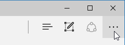
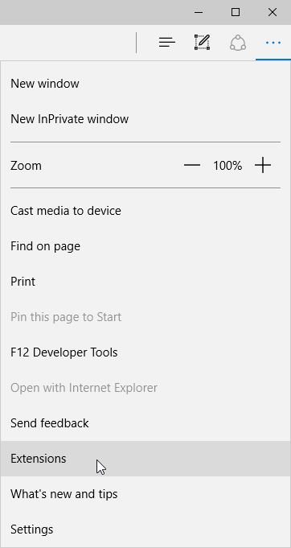
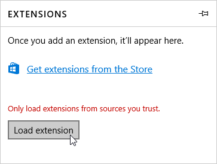
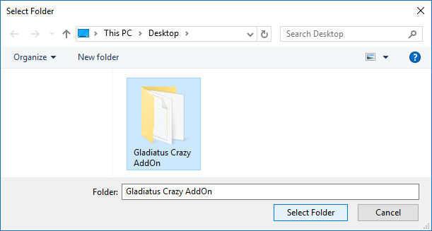

# Installation Documentation - Microsoft Edge

### How to install the addon on *Microsoft Edge* browser

- [Install using the *.zip* extension file](#install-using-the-zip-extension-file)

---

### Install using the *.zip* extension file

[*Step 1*] Extract the *.zip* file somewhere on your computer

[*Step 2*] Click on the *menu* icon and select "*Extensions*"

[*Step 3*] On the Extensions side bar, click on the "*Load extension*" button

[*Step 4*] Find and select the unzipped extension folder, and click "*Select folder*"

[*Step 5*] You successful installed the addon

---

Last update on 28-Jan-2017
