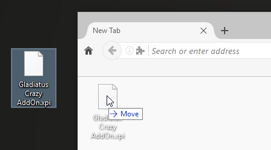
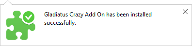
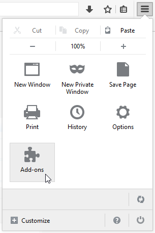
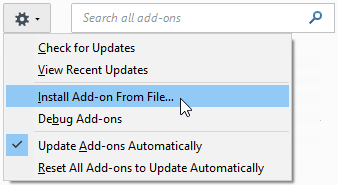
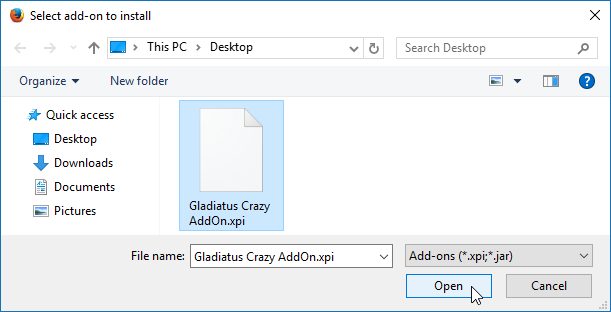
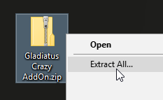
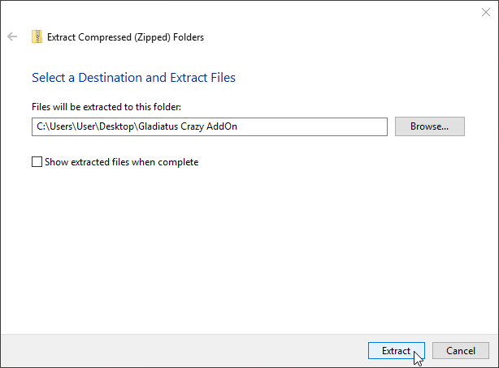
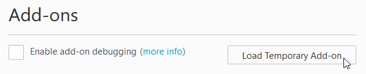
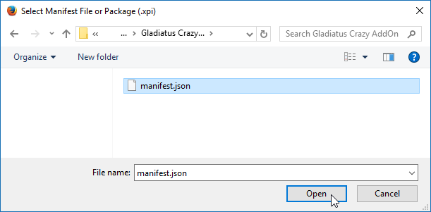

# Installation Documentation - Firefox

### How to install the addon on *Firefox* browser

- [Install using the *.xpi* extension file](#install-using-the-xpi-extension-file) (easier)
- [Install using the *.xpi* extension file (alternative)](#install-using-the-xpi-extension-file-alternative)
- [Install using the *.zip* extension file](#install-using-the-zip-extension-file) (not recomended)

---

### Install using the *.xpi* extension file

[*Step 1*] Drag'n'drop the *.xpi* file inside the firefox

[*Step 2*] Click on the "Install" button on the small popup notification

[*Step 3*] You successful installed the addon

---

### Install using the *.xpi* extension file (alternative)
[*Step 1*] Go to the Firefox’s addons page (about:addons)

[*Step 2*] Click on the gear icon on the top right corver and select the "Install Add-on From File..."

[*Step 3*] On the new window, find and open the *.xpi* file

---

### Install using the *.zip* extension file

This way of installing (loading) the addon is for developers. So it is not recomended for regular users.

[*Step 1*] Extract the *.zip* file somewhere on your computer

[*Step 2*] Go to the Firefox’s addon page (about:debugging#addons)

[*Step 3*] Click on the "*Load Temporary Add-on*" button

[*Step 4*] Find the unzipped extension folder and select the *manifest.json* file inside it

(if you get a manifest v3 error, delete manifest.json file and rename manifest_v2.json to manifest.json, then select it)

[*Step 5*] Now the addon is loaded into Firefox

---

Last update on 14-Sep-2022
