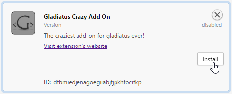
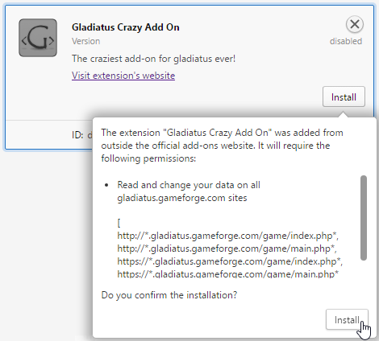
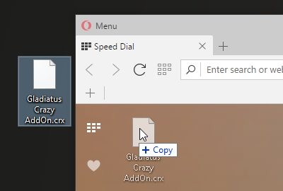
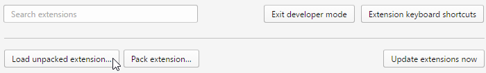
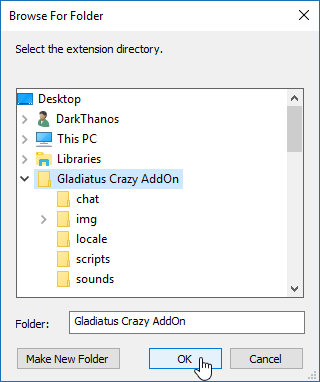

# Installation Documentation - Opera

### How to install the addon on *Opera* browser

- [Install from the *Google web store*](#install-from-the-google-web-store) (recomended)
- [Install using the *.crx* extension file](#install-using-the-crx-extension-file)
- [Install using the *.zip* extension file](#install-using-the-zip-extension-file) (not recomended)

---

### Install from the *Google web store*

This method needs the extension "[Download Chrome Extension](https://addons.opera.com/en/extensions/details/download-chrome-extension-9/)" to be installed on your Opera (it is installed by default).

[*Step 1*] Go to the addon's page on Google web store ([link here](https://chrome.google.com/webstore/detail/gladiatus-crazy-add-on/dfbmiedjenagoegiiabjfjpkhfocifkp))

[*Step 2*] Click on the *"+ ADD TO OPERA"* button, on the top right corner of the addon box

[*Step 3*] After a while a notification "*The extension was disabled...*" will appear, click the "*Go*" button to go the extensions page

[*Step 4*] Click the "*Install*" button to see the addon's required permissions

[*Step 5*] After reading the permisions, click the "*Install*" button at the bottom

[*Step 6*] You successful installed the addon

---

### Install using the *.crx* extension file

[*Step 1*] Drag'n'drop the *.crx* file inside the opera window

[*Step 2*] After a while a notification "*The extension was disabled...*" will appear, click the "*Go*" button to go the extensions page

[*Step 3*] Click the "*Install*" button to see the addon's required permissions

[*Step 4*] After reading the permisions, click the "*Install*" button at the bottom

[*Step 5*] You successful installed the addon

---

### Install using the *.zip* extension file

This way of installing (loading) the addon is for developers. So it is not recomended for regular users.

[*Step 1*] Extract the *.zip* file somewhere on your computer

[*Step 2*] Go to the Opera’s extensions manage page by clicking "*Menu > Extensions > Manage extensions*" (*ctrl+shift+E*)

[*Step 3*] Click on the "*Developer mode*" button

[*Step 4*] Click on the "*Load unpacked extension...*" button

[*Step 5*] On the small new window, find and select the unzipped extension folder

[*Step 6*] Click "OK" to load the extension and you are ready

---

Last update on 28-Jan-2017
